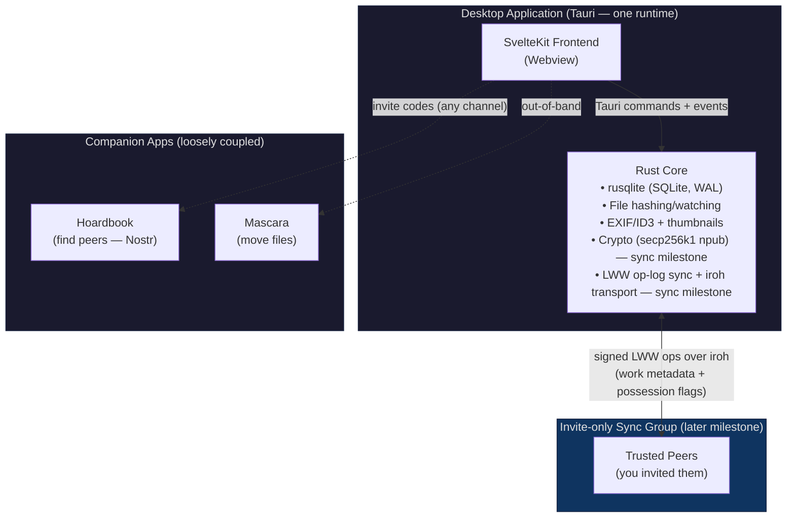
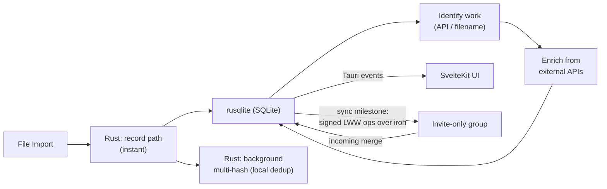

# Qurator - Project Specification

**Version:** 3.8
**Last Updated:** 2026-10-03
**Status:** Local-first 1.0 — implementation-ready. The sync milestone (invite-only group sync) requires prototyping. The public "club" layer (topics, reputation, governance) is **deferred-but-committed**, gated on a Sybil-resistance spike — see Development Approach → Roadmap.
**Premise:** A local-first archivist's cataloguer. Metadata merges by **work identity** within **invite-only groups**; Qurator hosts and transfers no files. Identity is a Nostr-native secp256k1 `npub`, shared one-per-family with **Hoardbook** (discovery) and **Mascara** (transfer). This supersedes the v2.9 public-P2P premise per `DECISIONS.md` (2026-06-13) and the independent appraisal it answered — see Changelog 3.0 and the Historical Appendix.

---

## Executive Summary

Qurator is the world's first **Distributed Digital Asset Management (DDAM)** system — a **local-first archivist's cataloguer** for a personal media hoard: import everything, let organization emerge, and enrich each work from external authorities and (later) from peers you trust. It runs as a single desktop application that owns your catalogue locally — no account, no server, and no network are required to get full value. A later expansion adds **invite-only group sync**, in which metadata about *released works* merges by **work identity** among peers who have chosen to form a group, turning isolated cataloguing into shared, compounding effort without a public network. Qurator deliberately **hosts and transfers no files** — discovery lives in the companion **Hoardbook**, file transfer in the companion **Mascara**.

**Design Philosophy:** Content-first, organize-later — users start with content, and organization emerges from their data, not the other way around. **Local-first by default; social only by invitation.**

### Core Value Propositions

1. **Content-First Workflow** — Import and work with content immediately; organize later when ready.
2. **The Archivist's Data Model** — Work/File abstraction, subject-based views, cross-media relationships, and completeness tracking — control that mainstream tools (Eagle, Plex) don't offer.
3. **Automated Enrichment** — Best-effort metadata from TMDb / MusicBrainz / OpenLibrary plus filename parsing, with per-work provenance you can audit.
4. **Emergent Organization** — Local saved views, subject-based views, and a shared taxonomy *vocabulary*.
5. **Trusted-Group Sync (later)** — Opt-in, invite-only merge of work-level metadata. No public network, and no reputation needed to decide whom to trust — you invited them.

---

## Glossary

> Semantic definitions of every core concept (per owner ruling R11, 2026-07-06). The full
> is/does/must-not contracts live in `DOMAIN_MODEL.md`; invariants in `SEMANTIC_MODEL.md`.
> Rn references are that document's rulings log. This glossary is binding vocabulary: specs,
> briefs, code comments, and UI copy use these words in exactly these senses.

- **Anchor** — the saved position inside a work that a pinned annotation points at (a video timestamp, an image region). Stores its coordinates **plus the authoring context** it was measured against (edition label, duration/dimensions fingerprint); renders exactly on a matching representation, visibly **≈ approximate** elsewhere; never references a file row (R11).
- **Annotation** — a note on a work: either about the whole work, or pinned to a spot via an anchor. Syncs at the sync milestone with source-peer attribution. Community property — no private variant exists ("Qurator is not your blog"); any member may edit or delete any annotation, history + revert as guardrails (R56). Whole-annotation LWW; deletes are tombstone ops.
- **Canonical (work)** — the transitive root of a `variant_of` chain; the entry dedup presents as primary (R9). Concurrent peer edits can merge into a cycle no local check saw: traversals stay cycle-safe, the cycle is flagged in library health, canonical resolution suspends for that chain, and members settle it socially — no algorithmic winner (R45).
- **Cascade (deletion)** — hard, DB-only deletion: a work's own rows die with it; `contains`-children die only if the deleted parent was their last parent; sub-works always die; disk files are never touched (R3/R3b). Delete repudiates membership in the collection — never a possession or taste marker (hide is, R23); in a group-mapped collection the shared work re-materializes fileless, correctly, and the delete dialog says so (R46).
- **Collection** — a named import root and **policy rulebook**: its type governs identification and sync eligibility [D16]. Collections are flat — they never nest; the nested experience is Views (R8). Type is **fixed at creation** — no retype; a mixed folder is the user's to reorganize (R4 moves), never Qurator's to sort (R40).
- **Compilation** — a work that `contains` member works but is backed by a single disk file (a VN "BEST OF" set, a 2-in-1 cartridge, an episode batch). Imports as **one work, as-is** (R35); members auto-link only when identification reveals them — otherwise they wait as pending members (R37); splitting the file's registration onto members is the user's act (R32).
- **Dissolve** — deleting only a grouping work and its `contains` edges, promoting the children; the repair path for wrong machine-made groupings (R3b).
- **Enrichment** — best-effort population of work metadata from external authorities; records which keys it wrote (per-key write provenance) so demotion can purge exactly those (R4). **Lazy by default** (R49): targets only empty fields unless explicitly told otherwise; an explicit refresh may overwrite unlocked fields, with manual-key overwrites highlighted (R28/B22); value-equal writes emit nothing; refresh cycles respect the last-run timestamp.
- **File** — a concrete representation of exactly one work (a specific rip, edition, scan, or encode); a device-local fact that never leaves the device [D4] and is never the work itself (R1). Carries the copy's technical/presentation specs — never the work's card (R31). One disk file may be registered under several works, one file row per work — the 2-in-1 cartridge case (R32).
- **File variant** — a copy whose difference lives in presentation/digitization (hardsubs, encode, resolution, scan quality), not in the source material: another file row of the same work, described on the file row (`specs.variant_label`), tracked locally only — never in the swarm (R34). Contrast **Variant**.
- **Filename-parsed identity** — a work identity minted by parsing a filename/path when no authority lists the work. Says nothing about who *made* the work — a fansub of a real anime is released content, never personal. **Local scaffolding until confirmed** (R38): it organizes the local library but never serializes into an op; curator confirmation promotes it to a legal merge key.
- **Identification** — resolving a work to a work identity via authority APIs or filename parsing, with per-work provenance [D19]. Correcting a wrong identity (rekey) purges the keys enrichment wrote under it and requeues enrichment under the new identity; user-authored fields survive (R50).
- **Identity string** — the literal text stored as a work identity (`tmdb:346`, `mb:…`, a minted ID). It is the *address* of sync: an arriving op updates the local work row(s) wearing the exactly-equal string.
- **Import exclusion** — user-configured import policy telling watched-root rescans to skip a path/hash; the answer to deletion-resurrection (R7). Exclusions are enumerable and editable in a management view — never lost-and-forgotten state (R42).
- **Merge (auto-merge)** — sync-era: combining work-level metadata across group peers whose works resolve to the same work identity [D2]; never triggered by byte hash.
- **Merge key** — the job the work identity does at the sync milestone: the key by which two peers' catalogues recognize "same work" and merge its metadata. Only work identities are merge keys; byte hashes never are [D2]. Qualifying kinds (R38): authority IDs, hybrid producer-minted IDs, and curator-**confirmed** identities (`identification_source ∈ {api, manual}`); raw filename parses never qualify.
- **Pending member** — a member label a compilation work carries in `metadata.pending_members` when its contents are known of but not yet resolvable to work rows (R37). Rendered as a dangling link in the UI and surfaced in library health; never a relationship row, never a work row. Resolving one (a later identification pass, or a manual link) creates the real `contains` edge and removes the entry.
- **Personal / Released / Hybrid** — collection types. *Personal:* self-made content; identification skipped; never syncs; every work has ≥1 file. *Released:* real-world-presence works; identification runs; fileless works allowed. *Hybrid:* released behavior plus producer-minted own works — which, being self-made, require files (R2/R14).
- **Possession** — derived work-level "I have this": possessed ⇔ ≥1 file row with status `local` **or `network_only`** — an absent volume never un-possesses (R36) — with an explicit, visible manual override for physical-media ownership (R6). The only file-derived bit that ever syncs [D4]. The override is upward-only — no "report as not-possessed" exists; declining out-of-band requests is always legitimate (R48).
- **Rekey (identity upgrade)** — replacing a work's `work_identity` string after creation. Two triggers: **upgrade** (an authority later lists the work, superseding a filename-parsed identity with an authority ID) and **correction** (the current identity is a wrong match). Rekey is a curator act: identification may *suggest* a rekey, never applies one silently — the merge address is changing, same no-silent-conversion spirit as R12. It rewrites only the identity string and `identification_source` provenance; metadata, files, tags, relationships, and annotations are untouched. Propagation (R39): the curator chooses **migrate** (history re-addresses onto the new identity; a local forward keeps delivering old-string arrivals) or **wipe** (old history discarded, old-string arrivals dropped); an informational re-address op lets other members choose the same for themselves — no enforced alias.
- **Relationship** — a typed work↔work link: `contains` (ordered membership, ordinal on the edge, multi-parent legal, acyclic), `variant_of` (directed toward the canonical, chains allowed, acyclic), `related_to` (loose association). All three types sync; cross-collection edges are legal — the discovery mechanism (R44). A receiver materializes an edge only when it holds both endpoints; otherwise the op waits in the log — no ghost endpoints.
- **Representation** — the role a file plays for a work: the work is the creative entity; files are how it exists on disk (R1).
- **Sub-collection / View** — one mechanism: a permanent, named filter over a collection or another view ("like views in SQL": `Anime → 80's anime → 80's mecha anime`). Membership is derived, composition is AND, no policy is carried, nothing is owned, never synced (R8). Node predicate grammar: AND of terms plus at most one NOT or one OR (R43).
- **Sub-work** — an ordered fragment of exactly one parent work (a manga page): fails the merge-anchor litmus, cannot outlive its parent, carries no identity, never appears in catalogue counts or sync (R5; built in 1.x). Fragments that could stand alone anywhere — album tracks in a cue-sheet rip, anthology stories — are never sub-works; they are works via the compilation machinery (R35/R37/R47).
- **Tag (objective)** — a pack-bound label; community metadata, sync-eligible, OR-set merge semantics. Booru-symmetric: any member may add or remove any value, ordinary ops, history + mass-revert as guardrails (R54). Arrivals from disabled/uninstalled packs or foreign language layers are stored hidden, never dropped (R54).
- **Tag (subjective)** — a free-form personal label; local-only, never synced. Subjective ⇔ no pack reference — one fact, one column (R16). Becomes pack-bound only by explicit confirmation (R12).
- **Tag pack** — a curated, read-only, versioned, language-layered set of objective tags; installable and enable/disable-able. A pack update that removes a value demotes existing uses to subjective, surfaced in library health (R13). A pack known to be outdated cannot apply new tags until updated (R55). In mixed-language groups per-layer tags accumulate in parallel; cross-language equivalence is a deferred semantic-engine concept (R55).
- **Tag wiki (wiki mode)** — an optional long-form page (prose + aliases + external links) attached to one *objective* tag value — booru-style (Danbooru/Gelbooru artist & character wikis), aimed first at author/artist/character/person tags. Its gallery is the existing tag filter, not a separate membership list; a subjective tag can never carry one (no shared address to hang it on). Community property at the sync milestone — same edit-by-anyone, whole-page LWW, tombstone-delete, history + revert model as Annotations; no private variant. Hidden whenever its tag pack is disabled/uninstalled; survives a pack-update demotion of its tag, orphaned until re-promoted or the pack reinstalled (R62).
- **Variant** — a work linked `variant_of` toward a canonical. The litmus vs "another file" is **where the difference originates** (R34, refining R10): in the source material (new cut, censored version, colorized print, different tracklist/edition identity) → a variant **work**, synced like any work; in presentation/digitization only (hardsubs, codec, resolution, scan quality) → a **file variant** of the same work, local-only.
- **Watched root** — a directory a collection monitors; rescans import what is present. A deleted work whose files remain will resurrect — correct behavior — unless an import exclusion is set; the delete flow says so (R7). Every root carries an invisible stub file (e.g. `.q`) naming its owning collection; a rescan that meets a foreign stub skips that subtree — nested roots stay in their lanes (R33).
- **Work** — the abstract creative entity, the catalogue's unit of meaning and the sync-era merge anchor. The hierarchy is works all the way down; files represent works, they are never the work (R1).
- **Work identity** — the merge key: an authority ID (`tmdb:` / `mb:` / `openlibrary:`), a producer-minted ID (hybrid), or a curator-confirmed identity promoted from a filename parse (R38) — raw parses are local scaffolding. Never derived from byte hash [D2]; never present on personal-collection works [D16]; never minted retroactively at sync-enable.
- *(Sync-milestone concepts, ratified in interview rounds 3–4:)*
- **Auto-materialize** — peer-known works appear in your mapped collection as fileless `possession=false` works, dimmed and badged; leaving the group detaches the non-possessed ones (R19). Detached ghosts take their per-work personal state (hides, subjective tags) with them; re-materialization after re-invite returns them unhidden — accepted, hides are cheap (R59).
- **Field lock** — pins a metadata field to a settled value. Double-edged by design (R51): the locked field is immune to local automation **and to incoming peer ops**, and it **emits no ops** — your value for that field never propagates out. Unlock re-derives the field from the op log (the pin never retroactively emits). Lock state is local-only, never serialized; the synced group-consensus lock remains a sync-layer-brief design (R28).
- **Group** — an invite-only set of peers, the only sharing unit [D5]; its catalogue is the union of members' attached collections (R18/R19); no owners, ranks, or blocking (R20); works are removed only by proposal + objection window (R21/R22).
- **Group mail** *(informal)* — how edits travel in a group: each edit becomes an op copied to every member, and each member's app applies it to its own work row wearing the matching identity string. Formally: op propagation — see **Op**.
- **Invite** — a single-use, expiring admission token; any member may mint one; grants membership and nothing else (R24). The joiner's bootstrap snapshot carries invite-level trust — no cross-member verification (R57).
- **Local hide** — a per-work, local-only, reversible hide flag, enumerable in a "hidden works" view; never syncs (R23).
- **Mass-revert-by-author** — revert every op a given author wrote since a chosen time, as one operation; the committed vandal response — reverts are ordinary synced ops (R20). Winner-only (R60): touches only fields where the author's op still wins; fields since repaired by others are left alone.
- **npub** — the secp256k1 Nostr-native identity shared across the app family [D11]; signs ops (attribution, not access control); absent in 1.0 [D22].
- **Op** — one signed write in the LWW op-log `(op_id, peer, hlc, work_identity, field_path, value)`, totally ordered by `(hlc, npub, op_id)`; reverts and deletion-consensus messages are ops too [D24]. HLC physical time is UTC-epoch — timezones are display-only; arrivals beyond the HLC drift bound are quarantined and surfaced, never silently applied or dropped (R58).
- **Petname** — your local label for a group member, overriding their self-declared name; names are labels, npub is the identity (R25).

---

## Motivation

### Why Qurator Exists

**Cataloguing effort is massively duplicated.** Cheap storage and the abundance of online media leave almost every long-time internet user with a large, dormant, haphazardly-organized hoard. Organizing it is perpetually deferred or abandoned — defeated by sheer volume and the rate of accumulation. Existing metadata sources (Wikipedia, IMDb, MusicBrainz, MangaUpdates) can't organize one's *own* collection; they are passive references to compare against, so every curator builds from scratch. And that work is overwhelmingly redundant: collections overlap heavily between users, so the same cataloguing is repeated thousands of times over. The waste disappears the moment one person's metadata work can cascade to everyone holding the same *work* — which is precisely what **auto-merge-by-work-identity** does within a trusted group. (beets proved match-against-authority for music; Qurator generalizes that across media for the local product, and adds trusted-peer merge for exactly the niches the authorities miss.)

**Metadata is scattered and untrusted; archivists are underserved.** Cataloguing data is spread across the internet with little cross-site consistency, making it tedious to decide which source to trust on import and undermining collaboration. Mainstream tools also presume the casual user rather than the dedicated archivist, who needs finer control — subject-based containers alongside medium-based ones, sub-collections that inherit from a parent, and relationships between works across media. That control is consistently missing.

**No single tool closes the whole gap.** Many are excellent within their lane — Eagle for solo visual asset management, Hydrus for community tagging, beets for music, Plex/Jellyfin for serving — but none combines cross-medium cataloguing, automated enrichment, data/metadata resilience, *and* decentralized collaboration. Qurator's bet is that intersection, not any single axis.

**The open internet is getting less free, not more.** Regulation, platform consolidation, takedowns, age-gating, link rot, and unstable archives all trend one direction; access to free information grows scarcer over time. Centralized metadata projects are single points of failure. A decentralized, local-first catalogue whose metadata is replicated across its community is resilient to this by construction — and aims not just to preserve information but to keep it flowing.

Folders are still important. They keep files organized and support stable workflows.

But folders can only show where a file lives. They cannot fully describe what an asset is, how it looks, where it fits, or why it may be useful again.

And visual assets rarely belong to just one path.

In many cases, the files can stay exactly where they are. What's missing is a richer way to understand and rediscover them.

The same model might need to be found by object type, material, room, style, project, approval status, source, or visual similarity.

That is why growing asset libraries need more than storage paths. They need previews, context, tags, metadata, filters, and different ways to browse the same collection.

Not to replace folders.
But to reduce how much the team has to remember.

Because a good asset library should not depend on memory alone.

### Thesis

Qurator is a content-first, **local-first** collection manager and metadata aggregator spanning *all* categorizable media. Attributes are defined on the fly rather than locked to a fixed schema, and content is organized by any axis in the database — medium, subject, creator, genre — not just file type. The product is complete and worth using with zero network. As an opt-in expansion, one contributor's enrichment propagates to peers in the *same invite-only group* who hold the same **work** (matched by work identity, not byte hash), turning isolated cataloguing into shared, compounding effort. Qurator manages and enriches metadata only; it deliberately does **not** host or transfer files — discovery and transfer are the companion apps' jobs (Hoardbook, Mascara), and each user remains responsible for their own content.

*(A public, stranger-facing "club" — open topics, reputation, community governance — is the project's long-term destination, but it is **deferred-but-committed** and gated on solving Sybil-resistance; it is not part of committed near-term scope. See Development Approach → Roadmap, tier ②.)*

---

## Target Users

**Primary Audience:** Prosumers — power users who need good UX but aren't developers. The design serves the **dedicated archivist** first, not the casual user: finer control (subject-based containers alongside medium-based ones, sub-collections that inherit from a parent, relationships between works across media) that mainstream tools consistently omit.

Two first-class roles, with **split feature paths** — neither is sold the other's features:
- **The personal-archive hoarder** — catalogues a private collection (family photos, home video, personal scans) that is *expected to have no external or peer matches*. A complete **local-only** user who may never form a sync group. Personal content is excluded from sync by default.
- **The released-works collector** — catalogues redistributed works (films, music, books, and scene/doujin/fansub content the APIs miss) that *do* resolve to shared work identities. This is the beneficiary of trusted-group sync.

A single library routinely mixes both (a NAS of films beside a folder of personal photos), so the distinction is per-**collection**, not per-library (see Data Model → Collections).

### Primary Use Case Focus

**Media Collections** — photo/video libraries, music catalogs, artwork portfolios, with metadata management, batch operations, and curated galleries.

**User Journey Examples:**

*Example 1: Personal-archive hoarder (local-only — no network involved)*
1. User imports 500 family photos into a **personal** collection (no setup required).
2. System auto-detects Image medium type and extracts EXIF; identification is **skipped** (personal content is presumed to have no external match).
3. User browses the gallery, tagging as they go.
4. User filters `year=2019 AND tag=vacation` (32 results) → "Save as view" → local "2019 Vacation" view.
5. Nothing leaves the device; this user gets full value with zero network.

*Example 2: Released-works collector (trusted-group sync — a later milestone)*
1. User imports an anime collection (200 videos) into a **released-works** collection.
2. System auto-categorizes and identifies each work against external APIs (plus filename parsing for what the APIs miss), recording per-file how the identity was resolved.
3. User forms or joins an **invite-only group** with collectors they already know (peers found via Hoardbook, then invited into the group).
4. Within the group, **work-level metadata** merges by work identity — sparse fields fill in with episode summaries and character info — and a work-level possession flag lets members see "who has what."
5. No public network and no reputation: trust comes from having invited each other. File-level hashes and paths never leave the device.

---

## Architecture Overview

### Platform Strategy

- **Desktop Application** (the product)
  - Cross-platform (Windows, macOS, Linux)
  - Built with **Tauri** — a Rust core and a SvelteKit webview, in **one runtime** (no sidecar process; see Technology Stack)
  - Full feature set, offline-first; the catalogue lives locally in SQLite (via rusqlite)
  - Update distribution: notify + prompt (user controls when to install)
  - Optional portable mode (CLI flag to store data relative to the executable)
  - Optional auto-start on login (disabled by default)

- **Web Application** — **deferred out of committed scope** (was Phase 3)
  - Cut from the committed roadmap with the move to an in-process desktop data layer. If it returns, it is a standalone server (PocketBase or equivalent) over the *same SQLite schema*, built at that point — not an architecture driver now. The desktop product does not depend on it. (`DECISIONS.md` [D12].)

### Technology Stack

#### Frontend
- **Framework:** Svelte/SvelteKit
- **UI Library:** Skeleton UI component library
- **Styling:** Tailwind CSS (via Skeleton UI)
- **State Management:** Svelte stores
- **Data access:** **Tauri commands + events** to the Rust core (no HTTP client, no separate API server)
- **UX Reference:** Eagle asset manager + foobar2000 hybrid (visual asset management + deep library customization)

#### Backend Architecture (Tauri — one runtime)

> **One runtime, in-process.** v3.0 drops the PocketBase Go sidecar. The reason PocketBase existed — to host **cr-sqlite** as a SQLite extension on PocketBase's SQLite — disappeared when cr-sqlite was abandoned (M1 spike, CR-PB-10 tripwire) and the sync CRDT moved into Rust. A sidecar would now be a materialized duplicate of the same SQLite data behind a localhost-HTTP hop — an invented dual-write problem plus a three-runtime lifecycle / orphan-process / notarization tax for a solo developer. So the desktop app is **Rust core + webview only**. (`DECISIONS.md` [D12].)

**Rust core (Tauri):**
- **rusqlite** — the catalogue is a local SQLite database accessed in-process (WAL mode; see Write Architecture & Contention). No ORM server, no REST layer; the frontend calls Rust commands.
- Native window management, system tray, and OS integration
- File system operations (watching, hashing, streaming) — read-only on source files
- Metadata extraction (EXIF/ID3), thumbnail and video-scrubbing preview generation
- Cryptographic identity (secp256k1 `npub`) and the **bespoke per-field LWW sync layer** (op-log in SQLite; Loro as documented fallback) + **iroh** transport — all arriving with the sync milestone (see §2 and Sync Layer); absent in 1.0
- A single priority-laned write-ahead queue feeding SQLite (see §9)

The frontend talks only to the Rust core; the Rust core owns the database, the filesystem, crypto, and (later) the network.

#### Architecture Diagram



#### Data Flow



#### Transport (sync milestone)

> **Status:** resolved. The sync milestone uses **iroh** as transport and a **bespoke per-field LWW op-log** as the sync layer, with **Loro** as the documented fallback (see Sync Layer). Retained for rationale; not an open decision.

**iroh** (Rust-native, QUIC-based, content-addressed) was selected and **partially validated** in the M1/M1.5 spikes: 2-peer, 3-peer, and 5-peer convergence, partition/rejoin, and signed ops all passed — on iroh **0.98.2**, localhost/relay. The real-infra NAT-traversal (IROH-07) and long-offline (IROH-08) tests were **never executed** (evidence dirs empty), and 1.0 GA (2026-06-15, stable wire-protocol guarantees) shipped after the spikes with breaking changes en route — so a GA regression of the passing suite plus IROH-07/08 is owed at the sync-layer spike (`SPIKE_LWW.md`) before the milestone claims a validated transport. Hypercore (Node.js) and libp2p were the considered alternatives; both are heavier fits and remain documented fallbacks only.

**Relay policy:** iroh direct hole-punch is preferred; iroh's hosted relay counts as a working path. Because sync is invite-only and discovery is offloaded to Hoardbook/Nostr, **the maintainer is never obligated to run infrastructure**: a group can ride n0's free public relays, self-host `iroh-relay` (~$70/yr for that group, not the project), or rely on one port-forwarding member (the tray always-on peer). n0's free public relays are documented as development/testing-grade, rate-limited, and retired on n0's own timetable — treat them as a **best-effort default**, with self-hosting or the port-forwarding member as the independence path. (`DECISIONS.md` [D21].)

#### Sync Layer

- **Bespoke per-field LWW op-log over SQLite** (primary, [D24]) — implements the conflict model the spec needs: **LWW registers + full history + one-click revert** ([D6]), owned in-repo rather than imported. iroh carries signed ops; convergence correctness is proven by the sync-layer harness spike before the milestone ships.
  - **Op model:** every synced write is an op `(op_id, peer_key, HLC timestamp, work_identity, field_path, value)` appended to an `ops` table; per-field last-writer-wins under the total order **`(hlc, peer_npub, op_id)`** — the `op_id` third term is required for totality (spike finding LWW-06/F1: without it, a peer reusing an HLC lets delivery order pick winners), and the npub encoding used in the tie-break (hex vs bech32 — they sort differently) must be frozen before first sync; multi-value fields (objective tags) use observed-remove set semantics with a deterministic min-`op_id` tie-break. Ops and the materialized `works` row commit in **one SQLite transaction** through the §9 write queue — one store, no dual-write. Materialized rows retain each synced field's winning `(hlc, peer)` watermark, so LWW comparisons survive op-log pruning (a returning long-offline writer merges correctly against a rebuilt dataset — per-field, never record-level).
  - **History & revert are native:** the per-item activity timeline is a query over the op log; revert is a new op. No extraction layer between the sync layer and the UI.
  - **Compaction is policy:** prune ops older than a configurable horizon while retaining current state; peers offline past the horizon (and newly invited members) bootstrap from a state snapshot + version vector. Identical-value op runs per field may additionally collapse to the latest op (R49).
  - *Why bespoke over a library ([D24], reversing [D20]):* the synced surface is flat work-level fields — no text or sequence merge — so a general-purpose CRDT is over-tooling; a library document would reintroduce the CRDT-doc ↔ SQLite dual representation that [D12] removed with PocketBase; the [D6] history/revert contract is native to an op log but opaque inside a library document; and row/field-level LWW in SQLite is the model M1 already validated functionally (CR-PB-01..09 — cr-sqlite died of maintenance, not correctness).
- **Loro** (documented fallback, [D24]) — stable 1.0 binary format, shallow snapshots (bounded history), LWW registers + history. Demoted on fit and bus factor (1–2 maintainers, sponsor-funded — the cr-sqlite failure shape), not quality. **Fallback triggers:** the harness spike surfaces convergence defects the bespoke layer can't cheaply fix, or collaborative text/sequence merge (e.g. co-edited annotations) enters committed scope. If triggered, pin with a `[loro]` maintenance tripwire.
  - The earlier **cr-sqlite** plan was abandoned in M1 (CR-PB-10 tripwire: dormant upstream); Automerge-rs replaced it and was in turn ruled out (never-delete history; Rust crate pre-1.0); Loro briefly held primary ([D20]) before this reversal. The chain is historical context — see the Historical Appendix and the banners on the spike files.
- Only **work-level** state syncs (title, `metadata`, `extra`, objective tags, relationships, annotations, possession flags); file-level rows never leave the device (see Data Model).

#### Vector Search (1.x)
- **usearch or hnswlib** (embedded lightweight), with a bundled small model (all-MiniLM, ~80MB) as an optional first-run download.
- Semantic/vector search and query-by-example are **1.x features**, after the 1.0 archivist core (see Roadmap) — not part of the 1.0 bundle.

#### Infrastructure
- **Discovery** — none run by the project. Peer discovery is **Hoardbook's** job (Nostr relays); Qurator joins groups via invite codes shared over any channel. The old "discovery server + bootstrap nodes" tier is removed — the discovery-funding problem dissolves rather than needing a solution. (`DECISIONS.md` [D9], [D21].)
- **Relays (sync milestone only)** — n0 public iroh relays by default; self-hosting documented; one port-forwarding group member removes the need entirely.
- **Translation Pack Repository** - GitHub repository, project maintainers curate
- **Theme Pack Repository** - GitHub repository for shareable UI themes and layouts (community-contributed)
- **Documentation Site** - **mdBook**, built from Markdown in-repo and published via **GitHub Pages** (GitHub Actions build-and-deploy on push to main); versioned alongside the code, no separate CMS or hosting bill. See Documentation Priorities.
- **CI/CD:** GitHub Actions
- **Distribution:** GitHub Releases with update notifications
- **Analytics:** Crash reports only (no usage telemetry)

---

## Core Features

### 1. Distributed Architecture (Sync Milestone)

> **Scope:** Everything in this section is the **sync milestone** — a later, opt-in expansion. The 1.0 product is local-only and uses none of it. There is **no public network**: sync happens only inside **invite-only groups** you form (`DECISIONS.md` [D3], [D5]).

#### Sync Model
- **Invite-only groups** - A group is a set of peers who have exchanged an invite. No public, open-write topics in committed scope; stranger *discovery* is Hoardbook's job, and a discovered stranger becomes a group member only by exchanging an invite ([D5], [D9]).
- **Merge by work identity** - Within a group, metadata about a **work** merges to every member who has that work (resolved by authority ID or filename parse — see Data Model → Auto-Merge), not by byte hash ([D2]).
- **What syncs** - **Work-level metadata + a work-level possession flag** ("I have this"). File-level hashes, paths, and specs **never leave the device** ([D4]).
- **LWW sync layer** - Convergence is handled by the bespoke per-field LWW op-log (LWW registers + history + revert; Loro as documented fallback, [D24]); iroh is the transport (see Technology Stack → Sync Layer). Eventual consistency: metadata merges over time, not instantly.
- **Personal content never syncs by default** - Collections typed `personal` are excluded from sync (see Data Model → Collections), limiting the synced surface to released/hybrid works among trusted peers ([D16]).

#### Storage Strategy
- **Reference Mode (Default)** - Files stay in original location, Qurator tracks paths
  - Users manage files through Qurator, not filesystem directly
  - Broken links highlighted in red in UI
  - Original files NEVER modified
  - **Auto-detect moved files** - Background reconciliation by hash, **scoped to the owning collection** (R41)
    - If same hash found elsewhere in the same collection's watched dirs, auto-update path; a matching hash under a *different* collection's root is a fresh import there, never a re-parent
- **Local-first** - All data stored locally in SQLite (via rusqlite)
- **Selective Sync** - Sharing is a **collection ↔ group mapping (many-to-many)**: attach sync-eligible collections to groups; a work syncs to exactly the groups its collection is attached to. No per-work exceptions — move the work to another collection instead (DOMAIN_MODEL R18/R4)
- **Smart Bandwidth Throttling** - Auto-detect network conditions

#### Content Hashing
- **Multi-hash** - MD5 + SHA256, computed lazily in the background (see File Hashing at Scale)
- **Hash-based local deduplication** - Content-addressed dedup *within the local library*. Hash is **no longer the merge key** — it demotes to local dedup plus one identity signal among several ([D2]).
- **Not the sync trigger** - Auto-merge fires on **work identity**, not on hash equality (see Data Model → Auto-Merge)

#### Large File Handling
- Qurator transfers no files (that is Mascara). For *local* large files: stream via the Rust layer, never load into memory; hashing is interruptible and resumable.

#### Group Connection (sync milestone)
- **Invite Links/Codes** - Share a group invite over any channel (a Hoardbook DM, or out-of-band)
- **NAT Traversal Policy** - iroh direct hole-punch preferred; iroh-hosted relay fallback is a working path (see Transport → relay policy)
- **No Peers Indicator** - Display "No peers online" when no group members are reachable

#### Discovery & the Hoardbook / Mascara ecosystem
- **Discovery is Hoardbook's job.** Qurator runs no discovery. Strangers find each other in Hoardbook (a Nostr-native phonebook), then exchange a Qurator group invite. Qurator stays discovery-agnostic and is fully usable with zero Hoardbook ([D9]).
- **File transfer is Mascara's job.** Qurator and Hoardbook both move no files; the actual byte-moving is the separate **Mascara** companion, arranged out-of-band ([D9]).
- **One-family identity.** Qurator, Hoardbook, and Mascara share a secp256k1 `npub` convention (§2); a Qurator identity is a Nostr identity, by default the same key as Hoardbook.
- *(Mesh transports for offline / air-gapped / LAN-local sync — e.g. FIPS — remain an evaluation track, side-by-side with iroh, never a near-term dependency.)*

### 2. Identity & Keys

> **No keys in 1.0.** The 1.0 local product needs no identity: onboarding is launch → import → done, with no key ceremony. Identity arrives **with the sync milestone**, when it earns its place. (`DECISIONS.md` [D22].)

- **Identity = a Nostr secp256k1 `npub`** (BIP-340 Schnorr) — the same key family as Hoardbook and Mascara, so a Qurator identity *is* a Nostr identity (no second key for Hoardbook discovery).
  - **One-family `npub` is the default** — the same key across Qurator + Hoardbook. Reuse links your library identity to your Hoardbook shelf; the privacy implication is shown at setup. A user who wants them apart can generate a **separate `npub`** for Qurator — an option, not the default. (Per the settled Hoardbook v0.9.6 position, which dropped the earlier forced-separation.)
  - **iroh transport key is separate and automatic** — each device mints its own iroh node key, bound under the `npub`; disposable plumbing, regenerable, never the identity.
  - Private key signs synced actions — **signatures are attribution, not access control**; "unauthorized" means an invalid/missing/forged signature. Group membership is gated by **invite**, not by signature.
- **Backup = BIP39 mnemonic** — at the sync milestone the user gets a Nostr-compatible mnemonic to back up (far more humane than a raw key file). Copy it to your own devices.
- **Loss is recoverable** — restore the identity from the mnemonic, **or** get re-invited to your groups. (Replaces the old "key loss = permanent lockout.")
- **Multi-device** — the same identity restores onto each device from the mnemonic; each device keeps its own iroh transport key. *(Open: live multi-device sync of one library is asserted, not yet designed — a **hard gate** on the sync milestone; see Roadmap → Gate B.)*
- **Key migration / succession** — deferred to the "Future" (club) appendix, where reputation continuity would make it matter. 1.0 and the sync milestone carry no reputation, so succession is out of near-term scope (mnemonic restore + re-invite cover loss).
- **Secure Key Storage** - Encrypted at rest by default at the sync milestone (DPAPI on Windows, 0600 elsewhere), mirroring Hoardbook; OS-keyring integration is a later hardening item.

### 3. Sync Groups & Taxonomy

#### Invite-only Sync Groups (replaces public "Topics")
- **A group is a sharing unit you form by invitation** — not a public topic. You invite peers (found via Hoardbook or known directly); they join with an invite code. No open-write public topics in committed scope ([D5]).
- **No ownership; social governance** - Among invited peers, disagreements resolve socially (LWW + history + revert, see §4), not by reputation or voting.
- **No per-member blocking** *(v3.3, DOMAIN_MODEL R20)* - Vandalism is answered by **mass-revert-by-author** (all ops are signed, so "revert everything X did since T" is one flash operation whose reverts sync like any edit) plus eviction (re-form). A member you merely dislike still makes good edits; hiding them would only degrade your own catalogue. Precedent: e-hentai — collaborative curation without per-user blocking.
- *(Public open-write topics, federated governance, and topic-specific reputation tiers are deferred-but-committed — see Roadmap tier ② / the Future appendix.)*

#### Group membership lifecycle (sync milestone — committed design note, 2026-07-03)
- **Invites are single-use and expiring.** An invite code admits one peer and dies (TTL + single redemption); a leaked stale invite admits no one.
- **Eviction = re-form.** v1 semantics: to remove a member, the remaining members re-form the group (new group ID) and re-invite everyone but the evictee; the old group is abandoned in place. Blunt but honest — matched to invite-group scale. (Cryptographic group epochs / MLS-style membership are club-era problems.)
- **Key compromise = new npub + re-invite.** Nostr has **no adopted key-rotation or revocation mechanism** (NIP-26 is `unrecommended`; NIP-41 remains an unmerged PR — verified 2026-07-02), so compromise recovery is app-level: mint a new npub, rejoin via re-invite; the group re-forms if the compromised key must be excluded. Announcing the successor from the old key is possible only while the old key is still held (voluntary migration, mirroring Hoardbook — never recovery for a lost key).
- **Un-shareability is disclosed, not solved.** Anything already synced to a member is durable on their machine ([OC-2]); eviction stops *future* deltas only. Covered by the §Privacy irrevocability disclosure at first sync.

#### Group Features (sync milestone)
- **Catalog Browsing via auto-materialize** *(v3.3, R19)* - Peer-known works auto-materialize into the mapped collection as fileless `possession=false` works, displayed dimmed/badged: the group catalogue *is* the collection; wishlist = `possession=false`. Leaving a group detaches its auto-materialized non-possessed works; anything you possess stays as local-only works
- **Cached Previews** - Thumbnails cached after first view
- **Wishlist** - See works members have that you don't (built on the work-level possession flag, [D4])

#### Taxonomy = vocabulary-as-data ([D8])
- **A project-curated, versioned taxonomy file**, shipped like a tag pack (e.g. Media > Video > Animation > Anime). A shared *vocabulary*, not a live federated structure.
- Sync groups may **label** themselves with a taxonomy path; Hoardbook tag autocomplete may draw from it.
- **No synced `topic_path` field on works, no registry service, no federated governance** in committed scope. The flat vocabulary file seeds a real taxonomy if public topics ever return.

#### Local Views (Personal, Not Shared)
- **Saved Filters** - Personal saved searches/views (never synced)
- **Local Organization** - Users organize locally however they prefer
- **No View Pollution** - Local views don't clutter shared group space
- **Per-context View Memory** - Remember view settings per Library/Group

### 4. Conflict Resolution (committed) & Governance (deferred)

> **The reputation / voting / Sybil / moderation superstructure is deferred-but-committed** — it returns with the public "club" and is specified in the Future appendix, gated on a Sybil-resistance spike. In invite-only groups you don't need it: you decide whom to trust by inviting them. (`DECISIONS.md` [D6], [D7].)

#### Conflict Resolution (sync milestone — committed)
- **Last-writer-wins per field**, with **full history retained** and **one-click revert** (revert is just a new edit). Settled socially among invited peers, not algorithmically ([D6]).
- **Mass-revert-by-author** *(v3.3, R20)* - Revert every op a given author wrote since a chosen time, in one operation; reverts are ordinary synced ops. This is the committed vandal response (with eviction as the follow-through); no per-member blocking exists.
- **Shared-catalogue removal is consensus-lite** *(v3.3, R21/R22 — scoped amendment to [D6])* - Field conflicts stay pure LWW; removing a work from the shared catalogue is the one consensual act: any member proposes, removal executes after an objection window unless any member objects — one objection cancels. Possessing members never lose data: they fork the collection (detach it from the group) or recategorize the work into another collection.
- **Field lock** *(v3.3, R28; semantics completed R51)* - A field can be locked to a settled value. The lock is double-edged: locked fields are immune to local automation **and to incoming peer ops**, and they emit no ops — the pinned value never propagates out; unlock re-derives the field from the op log. For some users that trade is exactly sufficient. Local state in 1.0; the synced group lock ("consensually agreed value") is designed in the sync-layer brief.
- **Display transforms vs. data values** - Only *display transforms* (translation rules, preferred tag-pack language layer, locale formatting) are local and **never synced**; the canonical synced value is always preserved alongside the transform. Among invited peers there is no reputation arbitration of values — LWW + history + revert is the whole model. (Resolves the prior "no local deviation vs translation rules" ambiguity.)

#### Governance superstructure (deferred — Future appendix)
These return with the public club and are **not** in committed scope; retained in the Future appendix, gated on Sybil-resistance:
- Content-based reputation, tiers, global score, asymmetric-risk voting, perpetual voting, weekly purge of zero-vote alternatives
- Meritocratic moderation, emergency rollback, content reporting
- **Sybil resistance** — the hard prerequisite. Free `npub`s make reputation gameable, so the club must not let reputation affect visibility or powers until a concrete mechanism ships. The deferral makes the **Nostr follow-graph / web-of-trust** available as the primary Sybil signal — the avenue the gating spike (Roadmap tier ②) evaluates.

### 5. Data Model & Metadata

#### Database Schema

**Storage model:** the catalogue is a set of **SQLite tables accessed in-process via rusqlite** (no PocketBase collections). A fixed, bounded set of tables handles all content types. Core fields are typed columns; medium-specific and topic-specific fields live in a `metadata` JSON column on `works`; unknown peer fields land in `extra` (JSON catch-all). This keeps the synced surface fixed and small, makes cross-medium search a single `SELECT`, and avoids unbounded table proliferation. At the sync milestone the **synced** columns below replicate at **work granularity** via the LWW op-log; everything else is strictly local.

| Table | Synced (sync milestone) | Purpose |
|---|---|---|
| `collections` | No (type drives sync eligibility) | Named collection per import root; typed personal / released / hybrid ([D16]) |
| `works` | Yes (title, metadata, extra, possession) | Abstract creative entity — canonical metadata, merge anchor |
| `files` | **No (never leaves the device)** | Concrete file representations — device-local paths, hashes, specs |
| `tags` | Objective tags only | Objective tags (tag-pack-governed, synced) + subjective tags (local-only, never synced) |
| `relationships` | Yes | Typed links between works (contains / variant_of / related_to) |
| `annotations` | Yes | Region- or timestamp-anchored notes on works |
| `tag_wikis` | Yes (sync milestone) | Long-form wiki page attached to one objective tag value — booru-style artist/character pages (R62) |
| `saved_views` | No | Personal saved filters/views — never synced |

**`collections` fields ([D16]):**
- `name` TEXT, `root_path` TEXT — the import root / watched folder this collection represents
- `type` TEXT enum (**personal** / **released** / **hybrid**) — drives identification policy *and* sync eligibility:
  - `personal` — identification skipped (presumed zero external matches); excluded from sync by default (shareable only to an explicit own-devices group)
  - `released` — work-level identification against external authorities; sync-eligible
  - `hybrid` — released behavior **plus** the user (a producer) may mint work identities for their own original works *(Open [OC-3]: producer-minted IDs need a non-colliding namespacing rule, e.g. producer-key-namespaced)*

**`works` fields:**
- `collection_id` relation → collections — drives identification + sync eligibility ([D16])
- `work_identity` TEXT indexed — the **merge key**: an authority ID (tmdb / mb / openlibrary) or a filename-parsed identity; raw parses are local scaffolding — only confirmed identities (`identification_source ∈ {api, manual}`) ever serialize into ops (R38); null for unidentified / personal works ([D2])
- `content_hash` TEXT indexed — SHA256 of canonical content; **local dedup + one identity signal only** (no longer the merge trigger)
- `identification_source` TEXT enum (api / filename / manual / failed) — per-work provenance for the library-health panel ([D19])
- `title` TEXT — synced (per-field LWW)
- `medium_type` TEXT enum (image / video / audio / book / document / other)
- `container_type` TEXT enum (gallery / standalone)
- `possession` BOOL — work-level "I have this"; the only file-derived bit that syncs ([D4])
- `metadata` JSON — medium-specific **work-level** facts only (true of every copy: duration, year, isbn, bpm, etc.); synced (field-level LWW on JSON field paths). Per-copy technical/presentation specs live on file rows, never here (R31)
- `extra` JSON — unknown fields from newer or foreign peers; preserved verbatim; synced (LWW); surfaced when the matching model/tag pack is installed

**`files` fields:**
- `work_id` relation → works
- `sha256` TEXT indexed, `md5` TEXT indexed
- `path` TEXT — device-local; not synced. Multiple rows may share one path when a single disk file backs several works (R32); dedup treats same-path rows as intentional
- `size_bytes` NUMBER, `mime_type` TEXT
- `status` TEXT enum (local / network_only / broken) — assigned by the volume-presence rule: volume/mount absent → `network_only` (calm; possession unchanged); volume present but file missing → `broken` (red) (R36)
- `specs` JSON — per-copy technical/presentation facts (dimensions, fps, codecs, container, channels, bitrate, subtitle burn-in, color space) plus an optional `variant_label` file-variant descriptor (R31/R34); device-local, never synced [D4]

**`tags` fields:**
- `work_id` relation → works
- `value` TEXT, `tag_pack_id` TEXT nullable (null = subjective)
- `is_subjective` BOOL — subjective tags are never synced
- `source_peer` TEXT (public key)

**`relationships` fields:**
- `from_work_id`, `to_work_id` relations → works
- `type` TEXT enum (contains / variant_of / related_to)

**`annotations` fields:**
- `work_id` relation → works
- `anchor` JSON ({type: region|timestamp, data: ...})
- `body` TEXT, `source_peer` TEXT

**`tag_wikis` fields (R62):**
- `tag_pack_id` TEXT, `value` TEXT — together the shared address; must reference an objective tag (never a null pack id)
- `body` TEXT (Markdown prose), `aliases` JSON (array of strings), `links` JSON (array of `{label, url}`)
- `source_peer` TEXT (public key) — sync-milestone attribution
- Visibility derives from the owning tag pack's enabled state (R54b); survives a pack-update demotion of its tag value, orphaned rather than deleted (R13/R62)

**`saved_views` fields:**
- `name` TEXT, `context_type` TEXT enum (library / topic), `context_id` TEXT nullable
- `filter_state` JSON — the serialised filter/query state

**Medium-specific `works.metadata` keys (Phase 1 — populated by extraction + external API enrichment):**

*image* — extracted from EXIF (capture facts — about the photograph, not the copy):
- `taken_at` (ISO datetime) — EXIF DateTimeOriginal
- `camera_make`, `camera_model` (string)
- `iso` (int), `aperture` (string e.g. "f/2.8"), `shutter_speed` (string), `focal_length_mm` (number)
- `gps_lat`, `gps_lon` (float, nullable)

*video* — extracted from container + TMDb enrichment:
- `duration_seconds` (number) — runtime is a work-identity fact (R10)
- `tmdb_id` (string), `tmdb_type` (string: movie / tv)
- `year` (int), `director` (array of strings), `genres` (array of strings), `overview` (text), `poster_path` (string)
- TV only: `series_title`, `season` (int), `episode` (int), `episode_title` (string)

*audio* — extracted from ID3 + MusicBrainz/AcoustID enrichment:
- `duration_seconds` (number)
- ID3: `artist`, `album_artist`, `album`, `composer` (strings); `track_number`, `disc_number`, `year` (int); `genre` (string)
- MusicBrainz: `mb_recording_id`, `mb_release_id`, `mb_artist_id` (strings)
- `acoustid` (string), `bpm` (number, nullable)

*book* — extracted from container + OpenLibrary enrichment:
- `page_count` (int), `isbn_13`, `isbn_10` (string), `language` (BCP-47)
- `author` (array of strings), `publisher` (string), `published_date` (string)
- `openlibrary_id` (string e.g. "OL12345W"), `description` (text)

*document* — extracted from file:
- `page_count`, `word_count` (int), `language` (BCP-47)
- `author` (string), `created_at`, `modified_at` (ISO datetime)

**Per-copy `files.specs` keys (R31/R34 — device-local, never synced [D4]; the catalogue card may display the primary local file's specs, computed locally):**

- *image:* `width`, `height` (int), `color_space` (string)
- *video:* `width`, `height` (int), `fps` (number), `video_codec`, `audio_codec`, `container` (string), `audio_channels` (int), `subtitle_languages` (array of BCP-47 strings, incl. burned-in/hardsub)
- *audio:* `bitrate_kbps`, `sample_rate_hz`, `channels` (int), `audio_codec` (string)
- *any medium:* `variant_label` (string, nullable) — the file-variant descriptor, e.g. "hardsub [Commie]" (R34)

**Required indexes (beyond content_hash, sha256, md5 already stated):**

| Table | Column(s) | Purpose |
|---|---|---|
| `works` | `medium_type` | Pill toggle counts; medium filtering |
| `works` | `title` | Alphabetical sort + FTS5 anchor |
| `works` | `created_at` | Default "most recent imports" sort |
| `works` | `container_type` | Gallery vs standalone filtering |
| `files` | `work_id` | Join to parent work |
| `files` | `status` | Broken/network-only filtering |
| `tags` | `work_id` | Join to parent work |
| `tags` | `is_subjective` | Objective/subjective split |
| `tags` | `tag_pack_id` | Filter by pack |
| `relationships` | `from_work_id`, `to_work_id` | Graph traversal (both directions) |
| `annotations` | `work_id` | Join to parent work |
| FTS5 virtual table | `works.title` | Full-text search across all medium types |

**Sync-milestone & deferred schema:**
- `group_members` — `public_key` TEXT PK, `display_name` TEXT (self-declared, cached; local petname override — R25), `joined_at`; **local-only** (sync milestone). *(v3.3: `blocked_at` dropped — blocking removed, R20.)*
- *(Dropped from committed scope: `topic_memberships` — taxonomy is vocabulary-as-data, not a synced field, [D8].)*
- *(Deferred to the Future / club appendix: `votes`, `reputation_events` — they return with the governance superstructure.)*

- **Application-level Validation** - JSON Schema validation in the frontend before the Rust write
- **Synced fields** - The work-level columns marked synced above replicate via the LWW op-log at the sync milestone; everything else is local
- **Schema-gated import (semantic models)** - A peer stores only the fields it has a semantic model for. Fields from a newer or foreign peer the local install doesn't understand are preserved verbatim in the `extra` JSON column rather than discarded — so they round-trip intact and surface once the matching model/tag pack is installed. (Core mitigation for cross-peer schema evolution.)

#### Content Types
- **Documents & Files** - PDFs, images, documents with metadata
- **Structured Data Entries** - Custom schemas defined by users
- **Multimedia Content** - Videos, audio, with media-specific metadata

**Work vs. File abstraction:**
- **Work** - The abstract creative entity (e.g. *Seven Samurai (1954)*, an album, a doujin) that holds the canonical metadata
- **File(s)** - The concrete representations of a work (a specific rip, edition, scan, or encode), each with its own hash and path
- A single work may have many files (different encodes/scans of the same cut — file variants, R34; edition-level differences like theatrical vs. director's cut are separate variant *works*, R10). Work-level metadata lives on the *work*; file-specific data (hash, path, codec, `specs`) lives on the *file*. This is the structural backbone for variant grouping and semantic deduplication.

**Container typing:**
- **Gallery** - A work whose members themselves contain sub-members (manga/comic pages within a volume, episodes within a series, tracks within an album). Drives completeness detection (missing pages/episodes/tracks).
- **Standalone** - Each member is a discrete unit (a painting, a feature film — discrete even when part of a series).

#### Auto-Merge by Work Identity
- **Trigger:** Two members of a group whose files resolve to the **same `work_identity`** (authority ID, or a curator-confirmed identity — raw filename parses never sync, R38) auto-merge that work's metadata. Byte hash is **not** the trigger ([D2]).
- **Multi-value Fields:** Union all values (e.g., tags combined)
- **Single-value Fields:** **Last-writer-wins**, with full history + one-click revert ([D6]). (No reputation priority in committed scope; the "External API > high-rep > low-rep" hierarchy is part of the deferred club.)
- **Personal collections never merge** - Identification is skipped, so they carry no `work_identity` and are excluded from sync ([D16]).
- **Full History:** All values visible in history.

#### Translation Rules
- **Local Display Preferences** - Translate network values to local preferred form
- **Example:** "seifuku" on network displays as "school uniform" locally
- **Storage:** Original network value stored in local DB
- **Community Repository** - Project maintainers curate shareable translation packs
- **Shareable Packs** - Browse and install from repository

#### Tag System

**Objective vs. Subjective tags:**
- **Objective tags** - Must belong to an installed *tag pack* (below); governed and synced across the network as community metadata
- **Subjective tags** - Free-form, personal, local-only; never synced, looser rules — "tag so *you* can find it later" vs. "tag so *others* can." Keeps personal organization from polluting the shared namespace

**Tag Packs** (sibling concept to translation packs):
- **What** - A curated, closed (read-only) set of tags bound by a common theme, installed and enable/disable-able per user. Disabling a pack hides its tags entirely (e.g. an R18 pack a user hasn't enabled never surfaces, even on explicit content)
- **Why** - Combats the failure modes of open community tagging: tag pollution from language/spelling variants, near-synonyms, and typos, plus *tag fatigue* (overwhelm from an unbounded tag soup)
- **Language layer** - Packs are hierarchical with **language at the top** (e.g. English / Japanese / romaji-English); a user picks one. So `paizuri` and `titjob` are simply different tags in different language trees, not sibling-linked — preserving existing booru/community naming conventions and avoiding translation arguments
- **Curated, read-only packs (committed scope)** - In 1.0, tag packs are simple curated, installable, read-only sets — no petition / vote / fork machinery ([D7]). A pack known to be outdated cannot apply new tags until updated to its latest version (R55).
- **Petition-to-add & forking (deferred)** - Community-governed petition (a tag joins when >50% of a pack's users support it, hard or soft vote) and forking into sub-packs are part of the deferred club — Future appendix.
- **Distribution** - Browse/install from the pack repository (alongside translation and theme packs)

#### Wiki Mode (tag wiki pages, R62)
- **What** - An optional long-form page attached to a single *objective* tag value — prose body, aliases, external links — booru-style (Danbooru/Gelbooru artist & character wikis). Aimed first at author/artist/character/person tags, but available to any objective tag; not a new noun class, an extension of Tag/TagPack
- **Aggregation** - The page's "gallery" is just the existing tag filter — every work carrying that tag, no separate membership list to maintain
- **1.0 scope** - Local editable text; a single local writer needs no conflict model
- **Sync milestone** - Becomes community property, the same model as Annotations (R56): any group member may edit; whole-page LWW; tombstone delete; full history + one-click revert; no private/local-only variant
- **Pack-bound visibility** - Follows its tag pack: hidden entirely when the pack is disabled/uninstalled, mirroring tag-hiding (R54b)
- **Survives pack-update demotion** - If a pack update demotes the tag value to subjective (R13), the wiki page persists (orphaned) rather than being deleted, and re-attaches if the value is ever re-promoted or the pack reinstalled

#### Metadata Extraction & Storage

**Non-Destructive Principle:**
- **Original files NEVER modified** - Files remain byte-for-byte identical
- **Read-only access** - Qurator only reads from original files
- **Separate metadata storage** - All changes stored in database, not files
- **EXIF/ID3 reading only** - Extract metadata but never write back
- **Thumbnails stored separately** - Generated previews go to cache, not embedded
- **Renaming caveat** - Even file renaming (which an earlier design permitted) is excluded by default, to preserve the path↔hash mapping. Any rename / organize-on-disk capability is opt-in, managed-mode only, and never touches reference-mode files. A future opt-in **edit mode** — temporarily suspending read-only for user-driven directory reorganization from inside Qurator — is a deferred concept under this caveat (R40); if it ever lands, the A4 allowlist gains it in the same slice

**Metadata Operations:**
- **Content-Type Detection** - Automatic MIME type identification
- **Filename & path parsing** - When hash/API matching fails (scene releases, doujin, fansubs not in any API), extract title/series/episode/edition from the filename and directory structure via configurable regex/templates (Shoko-style). Best-effort, fills blanks only — never overrides confirmed metadata
- **Media File Analysis** - Read EXIF data, video specs, duration (read-only)
- **Preview Generation**
  - Images: Thumbnails
  - Video: Scrubbing preview (frames at intervals for timeline hover)
- **Tag Management** - All tags stored in database, not in files
- **Metadata Editing** - Changes stored in Qurator DB, original files untouched
- **Annotations** - Region- or timestamp-anchored notes on media (a note on an image region, a comment at a video timestamp or audio position), stored in the DB separately from tags and core metadata

**External Data Sources (Phase 1 Priority):**
- **TMDb (The Movie Database)** - Movies and TV metadata. **Per-user API key** (decided 2026-07-03): movie/TV enrichment activates when the user supplies their own free TMDb key (one settings field + signup link); no project key ships in the binary — compliant with TMDb's non-commercial, revocable-at-will terms. Attribution (logo + notice) in About/Credits; API cache TTL ≤ 6 months (terms cap). MusicBrainz/OpenLibrary need no key, so zero-setup onboarding survives — only TMDb enrichment is key-gated.
- **MusicBrainz + AcoustID** - Music metadata with audio fingerprinting
- **OpenLibrary** - Book metadata

**Additional Sources (Later Phases):**
- **VGMDB** - Video game music
- **Discogs** - Music releases
- **TVDB** - TV series details
- **Wikidata** - Cross-domain entities

**Enrichment Behavior:**
- **Best-effort, Silent Import** - Try enrichment, import regardless of match
- **No special flagging** for unenriched content
- **Background Sync + Log** - Auto-update from APIs, log changes for review. **Lazy by default** (R49): only empty fields are targeted unless the user explicitly requests a refresh; refresh cycles respect the last-run timestamp; value-equal writes are suppressed (no write, no op)
- **Source Correction** - If upstream API is wrong, report upstream; wait for fix. *(Later feature, R49: for open sources that accept community fixes — e.g. MusicBrainz — contribute the correction upstream from within Qurator.)*
- **Local Cache Priority** - Cache API responses locally; (sync milestone) share cached responses within your group *(TMDb: verify the terms permit peer redistribution before building this — unresolved ToS question; MusicBrainz core data is CC0 and safe)*
  - Long TTL (30+ days) for cached data
  - Reduces external API calls

**Audio Fingerprinting (1.x — deferred out of 1.0, [D18]):**
- 1.0 identification = external API + ID3/EXIF + **filename/path parsing** only; AcoustID/pHash fingerprinting (and query-by-example, which needs it) land in 1.x. This drops Chromaprint native libs from the 1.0 bundle.
- When it lands: smart selection (fingerprint unidentified files only), background idle processing, skip if API match, user-triggered option.

**Metadata-Only Contributions:**
- **With External Source of Truth** - Can contribute metadata without possessing files
- **Without Source of Truth** - Must have files to contribute metadata

**File Organization:**
- **Reference Mode (Default)** - Files stay in original location, Qurator tracks paths
- **Broken Link Detection** - Missing files highlighted in red
- **Auto-detect Moved Files** - Background reconciliation by hash, scoped to the owning collection (R41)
- **Import Mode (Optional)** - Copy files to Qurator managed storage
- **Hybrid Mode** - Reference for large files, import for small files

### 6. Search & Discovery

#### Search Capabilities
- **Cross-Medium Search** - Single query searches across all medium types
- **Full-text Search** - Search through all content and metadata
- **Semantic/Vector Search** - AI-powered similarity search
  - **Local Embeddings Model** - Bundled small model (all-MiniLM)
  - **Aggressive Caching** - Pre-compute embeddings for fast searches
  - **Embedded Vector DB** - usearch or hnswlib
- **Query-by-example** - Find by a sample rather than text: drop in an image to find visually similar items, a frame to find its source video, or an audio clip to identify a track (builds on vector search + AcoustID fingerprinting)
- **Advanced Filters & Queries** - Filter by field, date, relationships, tags
- **Saved Views** - Personal reusable queries (local only)
- **Subject-based views** - Anchor a view on any field, entity, or relationship (creator, genre, subject) — not just medium type. If it's in the database, it can anchor a view

#### Filter UX (Hybrid Approach)
- **Visual Filter Builder** - Click to add filter chips, dropdowns for fields/operators
- **Search Bar with Syntax** - Power users can type queries like `genre:horror year:>2020`
- **Faceted Sidebar** - Available filters based on current content
- All three work together seamlessly

#### Semantic Deduplication
- **Variant Grouping** - Near-duplicates grouped with canonical entry + linked alternates
- **Examples:** Remaster vs original, theatrical vs director's cut
- **User Decision** - System suggests grouping; user confirms

### 7. User Interface

#### UI Customization & Theming (Riceability)

> **Design intent:** Qurator should be *intensely* personalizable — the kind of app users invest in and don't want to leave. The reference point is foobar2000's cult-level customization, not corporate minimalism. Appearance and layout are fully exposed and tweakable, stored as plain, shareable files — not buried in nested module config or compiled away.

**Signature default theme — "Clear Sky" (liquid glass):**
- **Goal:** A default so distinctive it becomes Qurator's visual identity — the ambition is to be as instantly recognizable as the Windows XP "Bliss" hill-and-sky wallpaper.
- **Background:** A clear blue sky with soft, drifting clouds, set behind the content surfaces.
- **Surfaces:** Liquid-glass / glassmorphism — translucent, frosted panels (backdrop blur, subtle saturation boost, soft inner highlights and hairline borders) layered over the sky so the background reads through chrome, sidebars, and the detail panel.
- **Implementation:** Expressed entirely through the theme-token layer (`backdrop-filter: blur()`, layered translucency tokens, the background image) so it is fully editable and forkable like any other theme — the default is itself a shipped, readable theme file, not hard-coded chrome.
- **Performance/accessibility notes:** Backdrop blur is GPU-cost-sensitive; provide a "reduce transparency" fallback (flat tinted surfaces) for low-end hardware and for users with `prefers-reduced-transparency` / `prefers-reduced-motion`. Maintain text contrast over the glass (contrast-guard tint behind text).

**Time-of-day theming — "Living Sky" (circadian transitions):**
- **Concept:** The default theme is *alive*. Rather than a binary light/dark toggle, "Clear Sky" continuously interpolates across the day on a circadian schedule — open Qurator at 11 AM and you get bright day mode (blue sky, clouds); leave it running and it drifts through golden afternoon into night, the way Wallpaper Engine's animated wallpapers evolve. Same iconic feel as the static default, but breathing.
- **Background arc:** day (clear blue + clouds) → afternoon (warmer, golden light) → dusk → night (dark star-field sky). Driven by the local clock; optionally aligned to real local sunrise/sunset (locale/geolocation) or a user-defined fixed schedule.
- **Foreground compensation:** as the sky darkens, text and icons progressively brighten — ending near-white at night — so legibility holds at *every* point in the cycle, not just at the endpoints (contrast is guarded continuously).
- **Glass at night:** liquid-glass surfaces gain a progressively brighter **neon / gold edge frame** as night falls, so panel and chrome edges stay visible against the dark sky.
- **Smooth, slow transitions:** changes ease gradually (animated-wallpaper feel), never an abrupt theme swap.
- **Implementation:** expressed as **time-keyframed theme tokens** — the engine interpolates (lerps) token values between keyframes based on time-of-day. The keyframe set is itself an editable, forkable theme file, so users can author their own living themes (synthwave dusk, forest day-cycle, etc.). This is a *superset* of the static theme format: a static theme is simply a single keyframe.
- **Controls:** pin to day or night, follow OS light/dark instead, set a custom schedule, or disable the animation entirely (snap to nearest keyframe).
- **Performance & accessibility:** token interpolation runs at a low cadence (CSS transitions fill the gaps) to avoid continuous repaint. Optional *motion* layers (drifting clouds, twinkling stars) are heavier and GPU-gated — off by default on low-end hardware. Honors `prefers-reduced-motion` (snap between keyframes, no animation) and `prefers-reduced-transparency` (flat surfaces; the neon edge frame still applies for definition).

- **Token-based theming** - Appearance is driven by design tokens (colors, spacing, radii, fonts, density, thumbnail size, grid gutters, badge/overlay styles) exposed as human-readable theme files, backed by Skeleton UI's CSS-variable theming
- **Plain, shareable theme files** - Themes live in `~/.config/qurator/themes/` (or portable-mode-relative), editable like dotfiles and shareable as a single file — no build step, no nested config
- **Hot reload** - The theme directory is watched (Rust file-watch layer); edits apply live without restart
- **User stylesheet escape hatch** - A `user.css` loaded last lets power users override anything the token layer doesn't reach
- **Layout customization (foobar2000-style)** - Panel arrangement, column sets, and view presets saved as portable files (visual layout editor in Phase 3)
- **Window-managed panels (owner directive, 2026-10-03)** - *"Instead of immoveable panels they should operate more like windows or linux, where each panel can be resized, moved, automated like hyprland etc."* Every panel (sidebar, content view, detail panel, library-health panel, etc.) is a managed window inside the app, not a fixed region:
  - **Resize** - any panel edge can be dragged to resize it
  - **Move** - panels can be dragged to a new position, docked, or re-arranged
  - **Automated arrangement (Hyprland-style)** - rule-driven layouts that place and size panels automatically (tiling), alongside free-floating panels — the user picks the behaviour, it is not hard-coded
  - **Saved as part of the layout file** - window arrangements and rules persist in the same portable, shareable layout files as the bullet above, so a layout can be riced and shared like a Hyprland config
  - **Open (not yet decided):** which milestone lands it, the rule/config format, and whether tiling, floating, or both ship first
- **Community theme repository** - Browse and install themes/layouts from a GitHub-hosted repo, mirroring the translation-pack model

**Boundary & safety (honest constraints):**
- The riceable surface is the **token / CSS-variable layer + `user.css`**, not arbitrary Tailwind utilities. Tailwind compiles at build time; a shipped build cannot recompile new utility classes at runtime. Theming targets the variables those utilities resolve to — large, but not literally "every class."
- **Themes are declarative only** — no executable JavaScript in a theme or layout pack. Shared `user.css` is sandboxed (e.g. external resource fetches restricted) so a "theme" cannot exfiltrate data or phone home.

#### Navigation Structure
- **Sidebar with Hierarchy**
  - My Library at top
  - Joined Groups below (sync milestone; optionally labeled by taxonomy path)
- **Per-context View Memory** - Remember settings per Library/Group
- **Tabbed browsing** - Open multiple views/items in tabs (browser-style)
- **Bookmarks** - Save a location (a view, a filter state, or an item) to jump back quickly

#### View Types
- **All Content View** - Default unified view of all items
  - **Medium Type Filtering:** Pill toggles above content (multi-select which types to show)
  - Quick filters and search bar
  - Default sort: Alphabetical by title
  - "Save current filter as view" (local only)
- **User-configurable Display:**
  - Thumbnail grid (visual-first like Eagle)
  - List with thumbnails (compact rows)
  - Adaptive by medium (images/video = grid, audio/text = list)
- **Table View** - Database/spreadsheet style (Airtable-like)
- **Kanban/Board View** - Card-based organization
- **Gallery View** - Visual grid for media
- **List View** - Simple linear listing

#### Item Display
- **Local vs Network Content:**
  - Network-only content appears dimmed/faded
  - Overlay badges showing source (local/network)
- **Click Network Content:** Show metadata only (no playback option)
- **Detail View:** Side panel (slides from right, list stays visible)

#### Keyboard Navigation
- Basic arrow keys + enter (standard navigation)
- Navigate items with arrows, Enter to open

#### Media Features (Phase 1)
- **Thumbnails** - Generate previews in Qurator
- **Video Scrubbing Preview** - Frames at intervals for timeline hover
- **External App Playback** - Open files in default system apps (no built-in players)
- **Metadata Editing** - Edit EXIF, ID3 tags, custom fields (stored in DB, not files)
- **Batch Operations** - All selection methods supported:
  - Selection mode toggle
  - Shift+click range select
  - Cmd/Ctrl+click multi-select
- **Completeness Detection** - Passive indicators only (badge/icon on incomplete collections)
  - Album completeness, TV series gaps, book series missing entries
  - User investigates if curious; no active notifications

#### Directory Processing
- **Watch Directories** - Monitor via OS filesystem events (inotify/FSEvents)
- **Bulk Import** - Import entire directory structures with metadata
- **Import Progress:** Summary view with expandable detailed log
- **Network Storage Support** - Process files from SMB/NFS/WebDAV shares
- **Pre-scan Analysis** - Scan directory to gauge library size; adapt behavior accordingly
- **In-progress Files:** Skip files being written/downloaded; auto-retry on next scan
- **Read-only access** - Never modifies source files

#### Collaboration UX
- **Activity Timeline per Item** - Full edit history (LWW + revert); available at the sync milestone
- **No Direct Messaging** - Users communicate via external channels (or Hoardbook) for private conversation
- *(Deferred club — Roadmap tier ②:) public discussion threads (forum-style, threaded with collapse), vote display, and reputation/tier indicators. Not in committed scope.*

#### Content Retention
- **User-controlled** - Each user decides how long to keep metadata for unavailable content
- **Unavailable Content** - When no peer has file, user chooses retention policy

### 8. Offline & Sync

#### Offline Capabilities
- **Full Offline Editing** - All features work offline (1.0 is offline by nature)
- **Selective Sync/Caching** - The collection ↔ group mapping (R18) decides what syncs; choose which mappings to keep active (sync milestone)
- **Conflict Resolution UI** - Clear interface for LWW history + one-click revert
- **Offline Indicators** - Visual cues for sync status

#### Sync Strategy (sync milestone)
- **LWW Sync Layer** - Conflict-free merge via the bespoke per-field LWW op-log (LWW + history + revert; Loro fallback); see Technology Stack → Sync Layer
- **iroh Transport** - Carries signed LWW ops between invite-only group members
- **Work-level only** - Work metadata + possession flags sync; files never leave the device (Qurator transfers no files — that is Mascara)
- **Smart Bandwidth Throttling** - Auto-detect network conditions, reduce on metered/slow

### 9. System Features

#### Undo System
- **Multi-level Undo History** - 10 actions deep
- **Session-based** - Resets on app restart

#### Long-Running Operations
- **Background Processing** - Run in background, user can continue working
- **Notification on Completion** - Notify when done

#### Background Service & System Tray
- **Close-to-tray vs. quit** - Configurable: closing the window minimizes to a system tray icon (BitTorrent-client model) rather than exiting; an explicit "Quit fully" remains available from the tray
- **Persistent background work** - While backgrounded, the app keeps hashing, enriching metadata, idle audio-fingerprinting, and watching directories — indexing finishes even with the window closed
- **Tray status** - Tray icon surfaces peer count, active transfers, and sync status at a glance
- **Always-on peer (sync milestone)** - With sync active, staying resident keeps the user reachable to group members for metadata sync, improving availability (mitigates the "No peers online" problem). Note: this is metadata reachability only — Qurator seeds no files.
- **Resource throttling when backgrounded** - Ties into smart bandwidth throttling; reduce CPU/network footprint while out of focus
- **Integrates with auto-start** - Pairs with the existing optional auto-start-on-login setting for a daemon-like experience
- Tauri provides native tray support and the intercept-close / hide-window pattern; the Rust core remains resident

#### Error Handling & Recovery
- **Database Corruption Detection** - Periodic background integrity check
- **Recovery Process:**
  1. SQLite integrity check + automatic repair attempt
  2. (sync milestone) If repair fails, re-sync work-level state from group peers via the sync layer
- **Graceful Sync Failures** - Handle network issues, auto-retry

#### Database Migrations
- **Rust-managed schema migrations** - Versioned SQL migrations applied via rusqlite
- **Version-tracked migrations** - Migration files for each release stored in repo
- **Automatic on update** - Migrations run on app launch after update
- **Never delete-and-recreate** in production — always migrate

#### File Hashing at Scale
- **Lazy hashing** - Hash on first access, not at import time
  - Import records file path immediately (user sees content instantly)
  - MD5 + SHA256 computed in background by Rust layer
  - Hash completion triggers dedup check and P2P merge
- **Async dual-hash** - Compute MD5 and SHA256 in parallel
- **Progress indication** - "Indexing: 847/2031 files" in status bar
- **Interruptible** - Can pause and resume hashing across sessions

#### Write Architecture & Contention (Scale)
> The **5M+ item** target (booru-scrape hoard scale — the motivating real-world pain point behind the Committed Performance Gates, owner, 2026-07-07) funnels concurrent writes from hashing, enrichment, import, thumbnails, P2P sync ingestion, CRDT merges, and user edits into one SQLite write lock. This must be designed against, not assumed away.

- **WAL mode** - The SQLite database (rusqlite) runs in WAL with a defined checkpoint policy
- **Single write-ahead queue (Rust layer)** - All background writers funnel through one serialized, batched queue with **priority lanes** (UI edits immediate; sync/hash/enrich batched)
- **Bounded merge batches** - CRDT merge ingestion applied in bounded batches with backpressure
- **Read paths** - UI queries read via WAL/read replicas, isolated from the write lane
- **Sharding threshold** - Benchmarks at 100k / 500k / 1M / **5M** synthetic items define the point at which the single-writer model is declared insufficient and hash-prefix sharding begins; **5M is a committed pass/fail gate** (Performance Requirements → Committed Performance Gates), not just a threshold-finding exercise
- **Stress tests** - Concurrent-writer stress tests are an acceptance criterion for the scale-hardening milestone
- **Local directories** - OS filesystem events (inotify/FSEvents) for instant detection
- **Network directories (SMB/NFS/WebDAV)** - Periodic polling (configurable interval, default 5 min)
- **Hybrid auto-detection** - System detects mount type and selects appropriate strategy
- **Network polling is best-effort** - No guarantee of instant detection; documented limitation

#### Thumbnail & Preview Cache
- **Image thumbnails** - 256px max dimension, JPEG quality 80, ~15-30KB each
- **Video scrubbing previews** - 1 frame per 30 seconds (not 10), 160px wide
  - 2-hour movie = ~240 frames × ~10KB = ~2.4MB per video (manageable)
  - 500 videos ≈ 1.2GB cache (acceptable for power users)
- **Cache eviction** - LRU eviction when cache exceeds configurable size limit (default 5GB)
- **Regenerable** - Cache is disposable; regenerate from source files on demand
- **Stored in a dedicated cache directory** (not alongside source files)

### 10. Legal & Moderation

> **Scope:** In committed scope (1.0 + invite-only sync) there is **nothing to moderate centrally** — Qurator hosts and transfers no files, and sync happens only inside groups you invited. The reputation-weighted *community self-governance* below belongs to the **deferred club** (§4 / Roadmap tier ②), not the near-term product.

- **No Platform-Level Moderation or Hosting** - The platform hosts no content and performs no central enforcement; it is content-neutral as an operator.
- **In invite-only groups, moderation is social** *(v3.3)* - You curate membership by invitation; vandalism is repaired by mass-revert-by-author and answered by eviction (re-form). No per-member blocking, and no reputation, voting tiers, or rollback machinery in committed scope (R20/R21).
- **Community self-governance (deferred club)** - Reputation-weighted voting, emergency rollback, and content reporting are part of the deferred public club, gated on Sybil-resistance. An optional enterprise governance layer (future) can enforce policy-based moderation on top.
- **User Responsibility** - Users face full legal liability for their own content.
- **Platform Does Not Host** - No central storage, no platform hosting liability.
- **GDPR / erasure** - The append-only-log erasure tension applies to the **deferred club**; see Security & Privacy → Privacy, Erasure & Legal Posture. In invite-only groups the synced surface is small (work-level metadata + possession), re-derived in reduced form when the club is designed.

---

## Performance Requirements

### Scale Targets
- **Adaptive Scaling** - Pre-scan directories to gauge library size
- **Support Range** - Hobbyist (10K items) to power-archivist / booru-scraper scale (**5M+ items**). Motivating case (owner, 2026-07-07): a booru-scrape hoard of millions of files is exactly the scale at which comparable tools (Hydrus) become unusable — sub-500ms browsing at that scale is a committed requirement, not an aspiration.
- **Large Library Adaptations (100K+ items):**
  - Virtualized rendering (only render visible items)
  - Progressive loading (lazy-load metadata/thumbnails)
  - Paginated SQL queries (don't load full dataset into memory)
  - Pill toggle counts and grouping computed via SQL aggregation, not client-side
  - Default view limited to most recent imports until user scrolls or filters
  - **Hash-prefix sharding** kicks in above the scale-hardening threshold (see Write Architecture & Contention) so query cost doesn't grow unbounded with library size

### Critical Performance Characteristics
- **Fast Cold Start Time** - Quick app launch even with large datasets, including multi-million-item libraries (see Committed Performance Gates below)
- **Smooth Sync Experience** - Background sync doesn't block UI
- **Efficient Large File Handling** - Handle GB-sized files gracefully
- **Responsive Search/Filtering** - **Sub-500ms results up to 5M items** (committed gate — see below), not merely "thousands"

### Committed Performance Gates (extends the 1.0 100k gate to hoarder scale)

> **Motivating pain point (owner, 2026-07-07):** Hydrus was "utterly unusable" once a booru-scrape hoard reached millions of files — this is exactly the scale Qurator must not fail at. The 1.0 gate below only proves the UI at 100k; the 1.x scale-hardening milestone is committed to the same pass/fail targets at 1M **and** 5M items — not merely a benchmark that "establishes a sharding threshold" and stops there.

- **1.0 gate (unchanged):** @100k items — cold start < 2 s; first view render < 500 ms; filter/facet apply < 300 ms; scroll p95 frame time < 16.7 ms; search < 500 ms (see Development Approach → Roadmap → 1.0 UI-performance gate).
- **1.x scale-hardening gate (committed 2026-07-07):** the *same five targets*, re-measured at **1M- and 5M-item synthetic fixtures**, on the same WebKitGTK floor platform. **Pass/fail, not benchmark-only** — the scale-hardening milestone is not *done* until these are green at 5M, exactly as the views milestone is gated at 100k. Hash-prefix sharding (Write Architecture & Contention) is the committed mechanism if the single-writer/single-index model can't hit these targets unsharded.
- **Beyond 5M:** out of committed scope for 1.x; revisit if real usage data shows hoards routinely exceeding it.

### Monitoring & Observability
- **Network Health (sync milestone)** - Monitor group peer connections and sync status
- **Storage Metrics** - Track database size, file storage, growth
- **Error Logging** - Comprehensive logs for debugging
- **Crash Reports** - Opt-in crash reporting (no usage analytics)

---

## Security & Privacy

### Security Model
- **Cryptographic Identity** - Public/private keypairs for all users
- **Signed Actions** - All writes signed with private key
- **Multi-hash Verification** - MD5 + SHA256 for content integrity
- **Key Backup Flow** - Guide users to backup keys securely

### Privacy, Erasure & Legal Posture (GDPR)
> **In committed scope this is a small surface.** 1.0 syncs nothing; the sync milestone syncs only **work-level metadata + a possession flag** inside **invite-only groups** — no public topic, no file-level forensic record. The append-only-log-vs-erasure tension below is principally a **deferred-club** concern (public topics), re-derived in reduced form when the club is designed.

- **Irrevocability disclosure** - Anything synced to a group peer is durable on their machine and cannot be force-deleted; the app states this plainly before the first group sync. (Possession flags are signed and durable — a deliberate, accepted residual; `DECISIONS.md` [OC-2].)
- **Edge disclosure** - A relationship edge you draw reveals the far endpoint's identity string — its *existence*, never its metadata or possession — to every group the edge emits to, including endpoints in collections never attached to that group. Accepted by design (cross-collection discovery is the point, R44/R52); stated in the same first-sync disclosure.
- **Cryptographic shredding of identity linkage** - Where erasure is required, destroy the key that links an identity to its human owner so historical entries become unattributable, rather than deleting CRDT history (which would break convergence). Design work, primarily for the deferred club.
- **Data minimization** - Keep personal data out of synced records by default; personal collections never sync; treat `npub` attribution as pseudonymous, not anonymous.
- **EU-compatibility stance** - Global erasure across a public topic is not guaranteed (a deferred-club property). Invite-only group sync keeps the surface small and consensual; self-hosted single-tenant deployments can enforce true retention/erasure.

### Error Handling & Recovery
- **Graceful Sync Failures** - Handle network issues, auto-retry
- **Database Corruption Recovery** - Auto-repair, then peer re-sync
- **Key Migration** - Signed succession for key changes
- **Detailed Error Logging** - Opt-in crash reporting

---

## Development Approach

### Roadmap — three tiers

> The committed build is **local-first first**, then sync. The public "club" is the long-term destination — **deferred-but-committed**, not "if it ever happens" — and is gated on a Sybil-resistance spike. Nothing is deleted; heavy features are *sequenced* ([D17]). One engineer.

#### Tier ① — Near-term committed

**1.0 — Local-first archivist cataloguer** (the shippable product; no network, no keys)

> **Build order (v3.1): validating slice first.** 1.0 proceeds in two stages. **Stage 1 — the validating slice:** import + background hashing → identification/enrichment with provenance → virtualized grid/list + FTS + hybrid filters + saved/subject-based views + detail panel — put into real archivist hands to validate the wedge (see Competitive Analysis → Strategic risk). **Stage 2 — 1.0 completion:** table/kanban views, tag packs, taxonomy-as-vocabulary file, theming depth (hot reload, `user.css`, theme repo), video scrubbing previews, portable mode. Stage 2 starts only after the slice is in use. Benchmarks gate at **100k items**; 500k/1M/5M fixtures move to 1.x scale-hardening (the **5M+** support target stands — booru-scrape scale, owner pain point 2026-07-07; see Performance Requirements → Committed Performance Gates).

- Tauri shell + **rusqlite in-process** (no PocketBase) — [D12]
- `collections` entity with personal / released / hybrid type — [D16]
- Import + background multi-hash (hash = local dedup only) — [D2]
- Work/File data model + container typing (gallery / standalone)
- Metadata extraction (EXIF/ID3) + external enrichment (TMDb / MusicBrainz / OpenLibrary) + **filename parsing**; work-level identification; **provenance instrumentation + library-health panel** — [D18][D19]
- Views (grid / list / table / kanban / side-panel), cross-medium FTS, hybrid filter UX, saved + **subject-based** views — positioned for the underserved archivist [D15]
- Tags + **simple curated tag packs** (no petition machinery) — [D7]
- **Tag wiki pages** (local editable text; community-property editing rides the sync milestone) — R62
- **Taxonomy-as-vocabulary** file — [D8]
- Theming / riceability foundation + **static Clear Sky** default — [D17]
- **mdBook documentation site**, built + published to GitHub Pages via GitHub Actions — user guides + deployment guides (see Documentation Priorities); Stage 2, non-blocking on the validating slice
- Tray background service, 10-level undo, storage scale-hardening (WAL + priority-laned write queue; 100k benchmarks gate 1.0, 500k/1M/5M in 1.x — 5M is a committed pass/fail gate, not benchmark-only)
- **No identity keys, no first-run ceremony** — [D22]
- **1.0 UI-performance gate (per Chorus review; contract committed 2026-07-03):** the virtualized library UI is the 1.0 critical path. **Virtualization:** `virtua` (Svelte-5-native, list + grid; TanStack svelte-virtual has an open Svelte 5 issue — do not assume it). **Fixtures:** synthetic corpora at 10k and **100k** items (mixed media, real-length titles, missing-thumbnail/error cases); the 1M and 5M fixtures move to 1.x scale-hardening, where the *same* pass/fail targets apply as a committed gate (Performance Requirements → Committed Performance Gates), not a benchmark-only exercise. **Floor platform:** WebKitGTK on Linux (Tauri's weakest renderer) on mid-range hardware — targets must pass there, not only on Windows/WebView2. **Pass/fail targets @100k:** cold start < 2 s; first view render < 500 ms; filter/facet apply < 300 ms (SQL aggregation, never client-side); scroll p95 frame time < 16.7 ms sustained; search < 500 ms. Facet counts + pagination via a defined SQL query contract; benchmarks run in CI via the E2E harness. The views milestone is not *done* until these pass.

**1.x — heavy features (retained, just sequenced)** — [D17]
- Fingerprinting (AcoustID / pHash) + query-by-example — [D18]
- Semantic / vector search (all-MiniLM, embedded vector DB)
- Network storage (SMB / NFS / WebDAV)
- Living Sky animated circadian engine + motion layers
- Plugin system *(scope TBD — importers / metadata extractors / view extensions; the 1.0 architecture should keep this aperture open so a 1.0 decision doesn't accidentally close it)*

**Sync milestone — invite-only group sync** (self-justifying expansion) — [D3][D5]
- secp256k1 identity + mnemonic backup — [D11][D22]
- **Bespoke per-field LWW op-log** (LWW + history + revert; OR-set tags); **Loro** documented fallback — [D24][D6]
- iroh transport (n0 relay default, self-host documented) — [D21]
- Invite-only sync groups, optionally labeled by taxonomy path — [D5][D8]
- Sync of **work metadata + possession flags**; catalog-browse / wishlist within groups — [D4]
- **Tag wiki pages become community property** — booru-style edit-by-anyone, whole-page LWW + tombstone delete, history + revert — R62
- P2P test harness validating **sync-layer** convergence (partition / clock-skew / scrambled delivery / snapshot bootstrap; CRDT-agnostic corpus so the Loro fallback re-runs unchanged) — [D24]
- **Gate A — merge utility ([D19], before heavy sync investment):** measure whether work-identity merge is worth building *before* building it. **Committed thresholds (2026-07-03, set before the measurement):** (1) **≥70%** of files in real released-works collections resolve to a confident `work_identity` (API or filename parse); (2) against at least one independent library export: **≥50 works overlap** AND **≥90% of overlapping works resolve to the same identity on both sides** (precision — guards against false-positive merges, not just coverage). Fail → the sync milestone is deprioritized in favor of 1.x. Thresholds may be re-litigated only *before* a re-measurement, never after seeing results. **Status (2026-07-04): deferred — no second library exists to measure overlap against ("no player 2"), and without a sync partner the gate's question is moot by construction. The identification-rate half accrues automatically from the [D19] library-health panel during normal 1.0 use; the overlap + agreement half runs when a real second library appears. The sync milestone remains blocked on this gate as written.**
- **Gate B — multi-device identity (per Chorus review):** before the milestone, design the device-join flow, the sync scope (full vs. selective), and the **same-identity-divergence conflict model** (incl. possession-flag convergence). "Restores per device" is not yet a design.
- **Gate C — hybrid work-ID namespace ([OC-3]):** hybrid collections are fine locally in 1.0, but their works are **sync-eligible only once** a normative non-colliding minting rule (e.g. producer-pubkey-namespaced IDs) is committed — work identity is the merge spine and must not collide across producers.
- **Gates A–C block the sync milestone, not 1.0** — 1.0 development proceeds independently of all three.
- **Identity transition:** identity is created when sync is first enabled; a 1.0 work is sync-eligible only if it already resolved to a `work_identity`. Works with none (and all `personal` collections) are **non-syncable by design** — the sync milestone does not retroactively mint identities.

#### Tier ② — Deferred-but-committed: the public "club"

The stranger-facing network is the project's long-term destination — **committed but later, and gated**. To be precise: what is *committed now* is the **gate** — a Sybil-resistance research spike with explicit acceptance criteria — **not** the club feature set, which stays a gated candidate until the spike passes. None of the club is built until then:
- Public open-write topics; reputation / tiers / asymmetric-risk voting / perpetual voting; meritocratic moderation + emergency rollback; federated taxonomy governance; tag-pack petition + forking; public discussion threads
- **Club gate (hard):** a Sybil-resistance spike must prove a credible mechanism — primarily the **Nostr follow-graph / web-of-trust** now available via the family identity — before any club code. The honeypot and GDPR-erasure residuals are re-derived in their *reduced* form (work-identity not file-hash; invite-scoped; pseudonymous Nostr) and accepted explicitly.
- Strangers still *find* each other via **Hoardbook**; the club is where they would interact at scale once the trust model holds.

#### Tier ③ — Declined / out of scope (never)
- In-app file hosting or transfer (Qurator moves no files — that is Mascara)
- A Hentai@Home-style volunteer full-file cache tier (declined on legal grounds, v2.4)
- Native mobile apps (responsive web only, if the web app returns)

### Milestone Plan (v2.8 — superseded)

> **Historical — superseded by the three-tier Roadmap above.** The 19-milestone list below predates the v3.0 local-first pivot and still names PocketBase, cr-sqlite, public P2P, and reputation as committed near-term work. It is retained only as build-sequence history; the spike milestone (M1/M1.5) is complete and its stack choices are now historical (see the Historical Appendix and the spike-file banners). Read the Roadmap above for the live plan.

1. **Architecture De-Risking Spikes** *(spike — no user-facing output; hard go/no-go gate)* — Prove or replace the riskiest stack choices against binary exit criteria: iroh **two-peer AND 3+ peer multi-writer** convergence with partition/rejoin, signed ops, conflict replay, and a NAT-traversal attempt; a custom PocketBase + cr-sqlite binary surviving collection creation, schema migration, indexed queries, deletes, conflict merges, app restart, backup/restore, and admin schema changes on CRDT-enabled tables; plus a one-page fallback evaluation (custom LWW / Automerge-rs) with a maintenance-trigger threshold. Failure branches the plan before dependent milestones proceed.
2. **Desktop App Shell** — A cross-platform Tauri app that cleanly launches, manages its PocketBase sidecar lifecycle, and renders an empty SvelteKit UI with portable-mode support.
3. **Design System Foundation (constrained)** — The locked token contract, accessibility baseline, theme-API constraints, and ~10–15 core primitives plus the **static** "Clear Sky" background, validated in a seed-data gallery. Explicitly excludes page layouts, composite components, and the animated "Living Sky" engine (deferred to M18).
4. **Cryptographic Identity & Key Management** — First-run keypair generation with the explain-then-generate ceremony, mandatory backup flow, signed actions, and key migration.
5. **Content Import & Background Hashing** — Drag-and-drop and bulk directory import that shows files instantly, then lazily multi-hashes them in the background with progress, dedup, and pre-scan.
6. **Background Service & System Tray** — Close-to-tray operation with a status tray icon that keeps background hashing (and later enrichment/watching) running with the window closed, so indexing progresses without the window open.
7. **Data Model & Content Views** — PocketBase schemas with the work/file abstraction and gallery/standalone typing, shown through grid, list, table, kanban, and side-panel detail views — including a **real-content audit** of the M3 primitives against imported data (long titles, missing thumbnails, dense tables, empty/error states).
8. **Metadata Extraction & External Enrichment** — Read-only EXIF/ID3 extraction, thumbnail and video-scrubbing previews, and best-effort silent enrichment from TMDb, MusicBrainz/AcoustID, and OpenLibrary (background-processed via the M6 service).
9. **Search, Filtering & Saved Views** — Cross-medium full-text search with the hybrid filter UX (chips, query syntax, facets), subject-based and local saved views, and pill-toggle medium grouping.
10. **Storage Scale-Hardening** — A single write-ahead queue in the Rust layer (batched, priority-laned) over WAL, isolated UI read paths, and benchmarks at 100k/500k/1M synthetic items that establish the threshold for topic/hash-prefix sharding.
11. **P2P Test Harness & Simulation** — A multi-instance harness (containerized peers with injected latency, partitions, and clock skew) plus a convergence/chaos test framework, established before live P2P so each P2P milestone has binary convergence acceptance criteria.
12. **P2P Sync & Auto-Merge by Hash** — Two+ running instances converge metadata over the network, auto-merging by content hash with eventual consistency and a no-peers indicator; acceptance gated on the M11 harness (e.g. 3 peers converge within N seconds after a 5-minute partition).
13. **Topics, Taxonomy & Catalog Browsing** — Joinable hierarchical topics with public/private discovery, selective sync, and catalog browsing of network content the user doesn't possess.
14. **Reputation, Sybil Resistance, Voting & Moderation** — Content-bootstrapped reputation with tiered display, asymmetric-risk perpetual voting, conflict resolution, emergency rollback, blocking, and reporting — **gated on a concrete Sybil-resistance mechanism** (web-of-trust / PoW / stake / rate limits), without which reputation does not affect visibility or powers.
15. **Collaboration, Translation & Tag Packs** — Public discussion threads, per-item activity timelines, and installable translation packs and language-layered tag packs from a community repository.
16. **Web App & Self-Hosting** — A responsive SvelteKit web client with basic CRUD plus a Dockerized PocketBase + static-files deployment with persistent volumes and env configuration.
17. **Semantic Search & Query-by-Example** — Local semantic/vector search and query-by-example (image/frame/audio-sample) over the embedded vector DB.
18. **Visual Layout Editor & Living Sky** — The foobar2000-style visual layout editor (portable layout files) and the deferred animated "Living Sky" circadian theme engine with GPU-gated motion layers.
19. **Plugin System & Extensibility** — A plugin architecture (API surface, sandboxing, lifecycle, repository integration) for community-contributed functionality.

### Testing Strategy
- **Unit Tests** - Functions and components
- **Integration Tests** - Import/enrichment, database operations; (sync milestone) sync-layer convergence
- **E2E UI Tests** - Playwright or Tauri test harness
- **P2P harness (sync milestone)** - Containerized peers with injected latency / partition / clock-skew; binary convergence criteria

### Accessibility
- **Best Effort** - Basic accessibility, not priority for MVP
- Focus on keyboard navigation and semantic HTML

---

## Data Import/Export

### Import
- **Directory Import** - Process local and network directories
- **No format import for MVP** - Focus on file-based content

### Export
- Future consideration for CSV, JSON, markdown export
- Optional: write metadata back to files on explicit user request

---

## Documentation Priorities

**Mechanism:** an **mdBook** site, source-controlled as Markdown in-repo (`docs/`), built and published to **GitHub Pages** by a GitHub Actions workflow on every push to main — no separate CMS, no hosting cost, versioned in lockstep with the code. Chosen over Docusaurus (heavier, Node/React toolchain the rest of the stack doesn't otherwise need) and over a plain GitHub Wiki (no build step, but weaker structure/theming/search); mdBook is Rust-native, matching the project's existing lightweight-native-tooling bias (Tauri over Electron, rusqlite over PocketBase, iroh over Hypercore).

1. **User Guides** - How-to guides for common workflows
2. **Deployment Guides** - Building from source; (sync milestone) self-hosting an iroh relay; (deferred) Docker / web self-hosting
3. **Architecture Docs** (Future) - Technical deep-dives
4. **API Documentation** (Future) - For contributors

---

## Key Technical Decisions & Rationale

### Why Tauri?
- Lighter weight than Electron
- Rust backend provides performance and safety
- Native system integration (file watching, OS events, crypto)
- The 1.0 core (Rust binary + rusqlite, **no PocketBase**) is light — roughly **~50–90MB** installed. The embedding model (~80MB) and Chromaprint/AcoustID fingerprinting libraries are **1.x optional first-run downloads** (not in the 1.0 bundle), so they don't inflate the base install — still far lighter than Electron for comparable features. (Earlier figures: "~45MB" counted only PocketBase + a minimal Rust binary; "~150–200MB" counted the v2.x sidecar + bundled model/fingerprint libs, both now gone from 1.0.)

### Why NOT PocketBase on desktop?
PocketBase existed in the v2.x design to host **cr-sqlite** as a SQLite extension on its SQLite. When cr-sqlite was abandoned (M1) and the sync CRDT moved into Rust, PocketBase became a materialized duplicate of the same data behind a localhost-HTTP hop — an invented dual-write problem plus a three-runtime lifecycle / orphan-process / notarization tax for a solo developer. So 1.0 uses **rusqlite in-process**, no sidecar. If a web app ever returns, PocketBase (or equivalent) becomes a standalone server over the same SQLite schema, built then. (`DECISIONS.md` [D12].)

### Why one runtime (Tauri + rusqlite)?
- One process (Rust core + webview) instead of two or three runtimes — no sidecar to supervise, no port conflicts, no orphan processes holding the SQLite lock, no extra binary to notarize on macOS
- The frontend talks to the Rust core via Tauri commands/events; the core owns the DB, filesystem, crypto, and (later) the network
- Rust does what it's best at: OS integration, file hashing, crypto, P2P

### Why iroh for transport? (sync milestone)
- Rust-native — aligns with the Rust core, no Node.js dependency
- QUIC-based NAT traversal; reached **1.0 GA (2026-06-15)** with stable wire-protocol guarantees
- Partially validated in the M1/M1.5 spikes (multi-peer convergence, partition/rejoin — on 0.98.2, localhost); GA regression + real-infra NAT / long-offline tests owed at the sync-layer spike (`SPIKE_LWW.md`)
- Alternative: Hypercore (proven but Node.js-only, would reintroduce runtime complexity) — documented fallback only

### Why a bespoke LWW op-log for Sync? (sync milestone)
- The synced surface is flat work-level fields — per-field LWW + OR-set tags, **no text or sequence merge** — so a general-purpose CRDT is over-tooling for it ([D24])
- One store: ops and materialized state commit in the same SQLite transaction — no CRDT-document ↔ SQLite dual representation, the failure shape [D12] removed with PocketBase
- The [D6] contract (full history + one-click revert + activity timeline) is *native* to an op log — the timeline is a query, revert is a new op — vs. opaque inside a library document
- Row/field-level LWW in SQLite is the model M1 validated functionally (CR-PB-01..09 passed; cr-sqlite died of maintenance, not correctness)
- Convergence correctness is owned in-repo and proven by a property-based + containerized harness with binary criteria before the milestone ships

### Why not Loro (fallback)? (sync milestone)
- Loro remains the strongest library candidate: stable 1.0 binary format, shallow snapshots (bounded history), LWW registers + history ([D20], superseded by [D24])
- Demoted on fit and risk, not quality: it solves problems this domain doesn't have (rich text, movable lists), reintroduces the dual-store problem, and carries a 1–2-maintainer, sponsor-funded bus factor — the cr-sqlite failure shape (verified 2026-07-02)
- **Fallback triggers:** the harness spike surfaces convergence defects the bespoke layer can't cheaply fix, or collaborative text/sequence merge (e.g. co-edited annotations) enters committed scope; if triggered, pin with a `[loro]` maintenance tripwire
- Supersedes the cr-sqlite (abandoned, M1) → Automerge-rs (M1.5) → Loro ([D20]) chain — historical context only

### Why Svelte/SvelteKit?
- Smaller bundle sizes than React
- Simpler state management
- Excellent performance
- Growing ecosystem
- Can share code between desktop and web

### Why Local Embeddings?
- No API costs or rate limits
- Works fully offline
- Privacy-preserving (no data sent to external services)
- Fast inference with small models
- Predictable performance

### Why Reference Mode Default?
- Users manage files through Qurator
- No storage duplication
- Works with existing file organization
- Broken links clearly visible (red highlight)
- Auto-detect moved files via hash

### Why Auto-merge by Work Identity?
- Automatic enrichment from a trusted group — without requiring byte-identical files
- Same *work*, shared knowledge; survives the re-encodes/repacks that break byte hashing
- Reduces duplication of effort exactly where the external authorities fall short ([D2])

### Why (deferred) Asymmetric Reputation Risk?
- Part of the deferred club, not committed scope. Rationale retained for the Future appendix: asymmetric risk (downvote risk > upvote gain) discourages low-quality edits and is self-policing — but only meaningful once Sybil-resistance makes reputation hard to fake.

### Why Local Cache Priority for APIs?
- Reduces external API load
- Faster responses from P2P cache
- Works offline with cached data
- Community shares enrichment work

### Why mdBook for Documentation?
- Rust-native — no added Node/React toolchain the rest of the stack doesn't already carry (unlike Docusaurus)
- Plain Markdown in-repo, versioned with the code; builds and deploys via GitHub Actions → GitHub Pages, zero hosting cost
- Built-in search and simple theming are enough for user/deployment guides; a plain GitHub Wiki gives up structure and search for no build-step savings that matter here
- Consistent with the project's existing lightweight-native-tooling bias (Tauri over Electron [D12]; iroh over Hypercore's Node.js runtime)

---

## Open Questions & Future Considerations

### Critical (resolved by the v3.0 pivot)
1. **Transport (sync milestone)** — **Resolved: iroh** (1.0 GA), validated in M1/M1.5; relay-as-pass NAT policy; n0-relay default with self-host documented. See Technology Stack → Transport. (`DECISIONS.md` [D21].)
2. **Sync CRDT** — **Resolved: bespoke per-field LWW op-log over SQLite**, with **Loro as documented fallback** (`DECISIONS.md` [D24], superseding [D20]). Supersedes the abandoned cr-sqlite and the M1.5 Automerge-rs pivot. Convergence is gated on the sync-layer harness spike.
3. **Desktop data layer** — **Resolved: rusqlite in-process**, no PocketBase sidecar. Schema is SQLite tables (six core + `collections`). See §5 Database Schema. (`DECISIONS.md` [D12].)
4. **Merge key** — **Resolved: work identity**, not byte hash; personal collections excluded from sync. (`DECISIONS.md` [D2], [D16].)

### For Phase 1 Clarification
1. What similarity threshold for semantic deduplication variant detection? (0.95? 0.90?)
2. How to handle partial matches in cross-medium search? (fuzzy matching)
3. What's the threshold for pre-scan to switch indexing strategies?
4. ~~PocketBase sidecar lifecycle~~ — moot in v3.0 (no sidecar; rusqlite is in-process)
5. Embedding model delivery — bundled or downloaded on first use? (~80MB impacts install size)

### For Phase 2
1. Specific reputation thresholds for each tier?
2. How frequently should peer statistics be updated?
3. What metadata should be included in topic registry?
4. LWW field-path granularity within `metadata` JSON (per-key vs nested-path LWW) and OR-set edge cases for multi-value fields?

### Post-MVP Features
1. End-to-end encryption of content
2. Schema migration UI for non-technical users
3. Public topic discovery directory
4. Mobile apps (iOS/Android) - currently not planned
5. Plugin/extension system (Phase 3)
6. Import from other platforms (Notion, Airtable, etc.)
7. Advanced media preview/playback in-app
8. Real-time co-editing
9. API for external integrations
10. Additional external data sources
11. Custom data source plugins
12. Batch metadata refresh from external sources
13. Multi-library support
14. Enterprise governance layer (RBAC, SSO/SAML, policy engine, compliance)
15. AI-assisted auto-tagging when no external source exists and sufficient training material is available
16. Reciprocal upstream contribution — push verified corrections back to source APIs (e.g. MusicBrainz)
17. Recommendation system + similar-creator / cross-domain creator map
18. Tag-as-folders navigation — browse and nest tags like folders (drag a tag into another to inherit), a virtual-filesystem-style organization layer

---

## Risk Assessment

### Technical Risks

| Risk | Impact | Mitigation |
|------|--------|------------|
| P2P NAT traversal failures (sync milestone) | Medium | iroh hole-punch + hosted relay; one port-forwarding group member removes the need |
| Transport maturity | Medium | iroh 1.0 GA; 0.98.2 partially validated in M1/M1.5 — GA regression + IROH-07/08 owed in `SPIKE_LWW.md`; documented Hypercore fallback |
| Sync-layer convergence correctness (bespoke LWW) | High | Property-based tests + containerized harness with binary criteria before sync ships; Loro documented fallback ([D24]) |
| Large file sync performance | Medium | Chunked transfers, selective sync |
| Vector search performance at scale | Medium | Aggressive caching, background indexing |
| Key loss by users | High | Clear warnings, backup flow, UX emphasis |
| Data integrity in auto-merge | High | Multi-hash verification, full history, source hierarchy |
| UX complexity for prosumers | High | Eagle/foobar2000-style familiar patterns, progressive disclosure |
| Sybil attack on reputation | High | Sybil-resistance gate (web-of-trust / PoW / stake / rate limits) before reputation affects visibility or powers; see §4 |
| SQLite single-writer contention at scale | High | Write-ahead queue + batching + WAL; benchmarks at 100k/500k/1M/5M (5M committed pass/fail gate, booru-scrape scale); topic/hash-prefix sharding beyond threshold |
| GDPR right-to-erasure vs append-only log | High | Cryptographic shredding of identity linkage; explicit EU-compatibility stance + irrevocability terms |
| Work-identity merge utility unmeasured | High | [D19] identification-rate + friend-overlap gate before building sync |
| App bundle size | Low | 1.0 ~50–90MB (no PocketBase); embedding model + fingerprinting libs are 1.x optional first-run downloads |

### Product Risks

| Risk | Impact | Mitigation |
|------|--------|------------|
| Reputation gaming / Sybil attack | High | Sybil-resistance gate required before reputation affects visibility or powers (web-of-trust / PoW / stake / rate limits); asymmetric risk + transparent voting on top |
| Low user adoption | High | Focus on media collection use case, clear value prop |
| Complexity vs. usability | High | Phased rollout, progressive disclosure, prosumer focus |

---

## Enterprise Considerations (Future)

> **Status:** Not in scope for MVP. Documented here to inform architectural decisions that should not preclude enterprise adoption later.

### Market Opportunity

Qurator's architecture maps to the **Digital Asset Management (DAM)** space rather than traditional CMS — but where every existing DAM, enterprise or solo, centralizes metadata on a server or a single machine, Qurator's invite-only group sync makes it the world's first **Distributed Digital Asset Management (DDAM)** system: metadata replicated peer-to-peer across a trusted group, with no central server at any tier. Enterprise DAM tools (Bynder, Brandfolder, Canto, Adobe AEM Assets) are cloud-locked, expensive per-seat, and impose rigid top-down taxonomy. Qurator's core strengths — data sovereignty, federated taxonomy, collaborative metadata governance, offline-first — address real enterprise pain points.

**Target verticals:** Regulated industries (healthcare, legal, government, defense), distributed field teams (construction, film production), creative agencies, research institutions.

### What Translates from Community to Enterprise

| Community Feature | Enterprise Value |
|---|---|
| P2P + self-hostable | Full data sovereignty, no vendor lock-in |
| Federated taxonomy | Domain experts own their branches |
| Reputation-based quality | Trusted teams produce higher-quality metadata |
| JSON Schema per topic | Departments define their own schemas |
| Offline-first + P2P | Air-gapped environments, field teams, distributed offices |
| Append-only audit trail | Compliance-friendly change history |
| Auto-merge by work identity | Cross-team metadata enrichment |

### Enterprise Governance Layer

An enterprise deployment would require a governance layer on top of the community core:

| Community Default | Enterprise Override |
|---|---|
| No content moderation | Policy engine + legal holds |
| Full transparency | Role-based access control (RBAC) |
| User-controlled retention | Enforced retention policies |
| Meritocratic moderation | Appointed admin roles |
| Self-managed keys | SSO/SAML + IT-managed credentials |
| Neutral network | Content classification + DLP |
| Open topics | Private topics with invite-only default |
| Tier names earned | Roles assigned by org hierarchy |

### Revenue Model Options

| Model | Description |
|---|---|
| **Open core** | Community edition fully open source. Enterprise governance layer is paid. (GitLab/Minio model) |
| **Support/hosting** | Everything open source. Enterprise pays for managed hosting, SLAs, support. |
| **Dual license** | AGPL for community (forces sharing). Commercial license for enterprise (allows proprietary use). |

### Architectural Guard Rails (Act on Now)

These decisions should be made during community development to keep the enterprise path open:

1. **Extensible identity system** — Design the cryptographic identity layer so SSO/SAML can wrap around keypairs later. Don't hard-couple user identity to raw key management.
2. **Flexible topic privacy** — Private-by-default should be a topic-level toggle, not an architectural addition. Ensure the P2P layer supports both modes cleanly.
3. **Moderation as policy, not architecture** — "No content moderation" should be the default *policy*, not a hard constraint in the protocol. The protocol should support content flagging, holds, and removal — the community edition simply doesn't enforce them.
4. **Pluggable auth** — Keep authentication as a distinct layer. Community uses keypairs directly. Enterprise wraps them in SSO. The rest of the system shouldn't care which auth method produced the identity.
5. **Retention hooks** — User-controlled retention is fine for community, but the retention system should support policy-driven overrides (e.g., "delete after 90 days" enforced by org policy) without redesigning the storage layer.
6. **Audit export** — The append-only log is good. Ensure it can be exported in standard compliance formats (CSV, SIEM-compatible JSON) for enterprise audit requirements.

### Why Not Now

1. The community product must prove the core works first — metadata governance, P2P sync, auto-merge
2. Community adoption validates the model for enterprise buyers
3. The governance layer is additive — RBAC, SSO, and policy engines layer on top without rearchitecting
4. Premature enterprise focus would compromise the prosumer UX that makes the community product compelling

---

## Success Metrics (Post-Launch)

### Technical Metrics
- App cold start time < 2 seconds
- Search response time < 500ms for 10k items
- Sync latency < 5 seconds for small changes
- File import throughput > 10 MB/s

### User Metrics
- Content items created per user
- User retention (7-day, 30-day)
- Metadata enrichment coverage (% of items with external API data)
- Identification rate (% of released-works items resolving to a confident `work_identity`) — the [D19] library-health metric
- (sync milestone) Peer connection success rate
- *(Club-era metrics — per-topic DAU, vote participation — deferred with the club.)*

---

## Constraints & Assumptions

### Constraints
- Desktop-first development (web app deferred out of committed scope)
- Local-first: all data stored locally; no central server; **sync (later) is invite-only, never public**
- Keys only at the sync milestone (mnemonic-backed); 1.0 needs none
- Network connectivity required only for enrichment and (later) sync; all local work is offline
- No project-run discovery infrastructure (discovery is Hoardbook's job)
- **Original files never modified** - All metadata changes stored separately
- **Open-source community edition (AGPL)** - The community edition is fully open source, with no paid tiers and no feature gating. An optional future *enterprise governance layer* (RBAC, SSO/SAML, policy engine, legal holds) may be offered under a separate commercial license as an **additive module that never gates or degrades the community edition**. (Resolves the prior open-source-vs-revenue contradiction.)
- **No centralized / platform moderation** - The platform hosts nothing and enforces nothing centrally. In committed scope, moderation is social (curate group membership; block locally). The reputation/voting self-governance is part of the **deferred club** (§4 / §10), not the near-term product.
- **Crash reports only** - No usage analytics

### Assumptions
- Target users are prosumers (power users, not developers)
- Users have reliable internet for sync operations
- Media collections are primary use case
- Users value data ownership over convenience
- Users will manage files through Qurator, not filesystem directly

---

## Initial User Experience (Bottom-Up Flow)

### First Launch - Import-Focused Onboarding

**Qurator Approach (Bottom-Up):**
```
Launch app → Import content → (Done!)
Organization happens later, if/when needed
```

### The First 5 Minutes

1. **Launch Qurator** - Opens to empty "All Content" view with prominent import button
2. **Drag & drop files** or select folder - No prompts, no configuration, **no key ceremony** (identity arrives only with the sync milestone — [D22])
3. **Pre-scan runs** - System gauges library size, adapts indexing
4. **Import Progress** - Summary with expandable log
5. **Content appears immediately** - Auto-grouped by medium type with pill toggles
6. **Automatic enrichment** - System fetches metadata silently from external APIs
7. **Start working** - View, search, filter, tag - no organization required

### When Organization Happens (Optional)

- **Week 1:** User has 500 files, just browsing and tagging
- **Week 2:** User filters frequently: `genre=action AND year>2020`
- **Week 3:** User clicks "Save this filter as view" → Creates local "Recent Action Movies" view
- **Month 2 (sync milestone):** User forms or joins an invite-only "Movies" group to sync metadata with trusted collectors
- **Never:** Some users never join a group, just use local features - totally fine!

### Key UX Principles

1. **No Empty States** - First experience is always full of content, not empty forms
2. **Progressive Disclosure** - Advanced features appear when relevant, not upfront
3. **Defer Decisions** - No forced choices at import time
4. **Undo-Friendly** - 10-level undo history for mistakes
5. **Local vs Shared Separation** - Views are personal; sync groups are shared
6. **Non-Destructive** - Original files never modified; all metadata stored separately

---

## Next Steps

1. **Build the 1.0 local core** - Tauri + rusqlite shell; collections (personal / released / hybrid); import + background hashing
2. **Data model + views** - Work/File + container typing; grid / list / table / kanban / side-panel
3. **Enrichment + provenance** - TMDb / MusicBrainz / OpenLibrary + filename parsing; `identification_source` + library-health panel ([D19])
4. **Search, filters, saved & subject-based views; tags + simple tag packs; theming + static Clear Sky**
5. **Run the [D19] gate** - Measure identification-rate + friend-overlap *before* building any sync
6. **Sync milestone (if the gate passes)** - secp256k1 keys + mnemonic; bespoke LWW op-log + iroh (Loro fallback); invite-only groups; P2P harness
7. **Club gate (deferred)** - Sybil-resistance spike on the Nostr web-of-trust before any club code

---

## Appendix

### Technology References

**Core Stack:**
- **Tauri:** https://tauri.app/
- **rusqlite:** https://github.com/rusqlite/rusqlite
- **SvelteKit:** https://kit.svelte.dev/
- **Skeleton UI:** https://www.skeleton.dev/

**Sync (sync milestone):**
- **Bespoke per-field LWW op-log** — in-repo (see Technology Stack → Sync Layer)
- **iroh:** https://iroh.computer/
- **Loro (fallback):** https://loro.dev/
- *(Historical — cr-sqlite, Automerge-rs, Hypercore: see Historical Appendix / Changelog.)*

**Other:**
- **usearch:** https://github.com/unum-cloud/usearch
- **JSON Schema:** https://json-schema.org/

### External Data Sources (Phase 1)
- **TMDb (The Movie Database):** https://www.themoviedb.org/documentation/api
  - Comprehensive movie and TV database
  - Free API with registration
  - Images, cast, crew, ratings
- **MusicBrainz:** https://musicbrainz.org/doc/MusicBrainz_API
  - Open music encyclopedia with extensive metadata
  - Free API, no rate limits with identification
  - Covers artists, albums, recordings, relationships
- **AcoustID/Chromaprint:** https://acoustid.org/
  - Audio fingerprinting for music identification
  - Works with MusicBrainz for accurate matching
  - Open source, free API
- **OpenLibrary:** https://openlibrary.org/developers/api
  - Book metadata from Internet Archive
  - Free, no API key required

### External Data Sources (Later Phases)
- **VGMDB:** https://vgmdb.net/ - Video game music
- **TVDB:** https://thetvdb.com/api-information - TV series details
- **Discogs:** https://www.discogs.com/developers - Music releases
- **Wikidata:** https://www.wikidata.org/wiki/Wikidata:Data_access - Cross-domain

### UX References
- **Eagle** - Visual asset management, fast browsing, tagging
- **foobar2000** - Powerful, customizable, library-focused music player

### Design & Customization Inspiration (Riceability / Identity)

> Reference apps for the "intensely personalizable, identity-forward, anti-corporate-minimalist" direction — with the specific lesson to crib from each. The throughline: the customization *is* the product, and users share their setups as a form of identity. Guiding caution: the failure mode of this space is *customization-as-procrastination* — depth must reward the few without taxing the many, so the **default must be stunning out-of-the-box** while the depth stays bottomless (Playnite and Obsidian both nail this balance).

**Closest analogs (collection manager + deep theming):**
- **Playnite** - Open-source game *library manager* with a thriving installable-theme ecosystem. Closest problem-shape to Qurator. Crib: theme packaging/distribution, and how far a theme may restructure layout vs. recolor.
- **Obsidian** - Local-first, files-as-data, huge CSS-snippet + community-theme culture. Crib: the `user.css`-style snippet toggle system, theme gallery, and themes/plugins coexisting without bricking the app.
- **Jellyfin** - Self-hosted media server with a custom-CSS community and themeable client. Crib: safe-ish CSS injection and theme sharing (relevant to media + self-host).

**Ricing / sharing-culture ethos (dotfiles as identity):**
- **r/unixporn + Linux dotfiles (Hyprland/AwesomeWM)** - The social loop is the moat: screenshot → link your config repo → others fork. Crib: shareable-config-as-identity.
- **Rainmeter** - Shareable desktop skins, community distribution. The original "make your desktop yours."
- **Spicetify** - Theme-injection layer over Spotify. Crib: clean theme-injection architecture — and its fragility on host updates (cautionary tale for the token-vs-arbitrary-CSS boundary).
- **VS Code theme marketplace** - Proof a theme gallery drives stickiness; crib the discovery/install UX.

**Time-based / dynamic (for "Living Sky"):**
- **macOS Dynamic Desktop** - Time-keyframed wallpaper (dawn→day→dusk→night); the closest existing implementation of the Living Sky idea (keyframes + sun position).
- **Material You / Monet (Android)** - Derives the UI palette *from the wallpaper*. Crib: derive accent/contrast tokens from the *current* sky color so chrome harmonizes as the background shifts.
- **Wallpaper Engine** - Animated-background motion layer + Workshop sharing model.
- **f.lux / Night Shift / Redshift** - Prior art for the scheduling logic (clock vs. geolocation sunrise/sunset).

**Identity / curation / craft (anti-algorithm wing):**
- **Are.na** - Calm, anti-feed *curation* tool. Since Qurator is curation, crib how collecting feels intentional and personal rather than algorithmic.
- **Arc browser** - Bold emotional/identity-forward design; its *Boosts* let users reskin any site. Study as a design case (Arc has since been wound down in favor of the maker's AI browser), not a living product to chase.
- **Vivaldi** - Explicitly anti-minimalist power-user browser; nearly every UI element exposed and themeable. Crib: expose everything without drowning the user.
- **Bear / iA Writer / Ulysses** - Craft and typographic restraint — the counterweight so the maximalist defaults don't tip into garish.

### Similar Projects (Inspiration)
- **Airtable** - Flexible database views
- **Notion** - Document + database hybrid
- **Raindrop.io** - Content curation
- **Zotero** - Academic reference management
- **OrbitDB** - Distributed database on IPFS
- **Keet** - P2P chat built on Hypercore
- **Bynder / Brandfolder** - Enterprise DAM (competitive landscape for enterprise layer)
- **Plex/Jellyfin** - Media server aesthetic

### Competitive Analysis (2026-04-02)

#### Qurator vs Connecter (Enterprise DAM)

| Dimension | **Qurator** | **Connecter** |
|-----------|-------------|---------------|
| Architecture | Local-first, P2P decentralized | Hybrid DAM (local assets + cloud metadata) |
| Data Sovereignty | Full — all data on user's machine | Partial — assets local, metadata cloud/self-hosted PostgreSQL |
| Internet Required | No (offline-first; internet for P2P only) | Yes — always required for team/user management |
| Pricing | Free, fully open source | SaaS subscription tiers |
| Collaboration | Invite-only group metadata sync (sync milestone) | Real-time markup/feedback, version control, workflows |
| AI Features | Local embeddings for semantic search (Phase 3) | AI Studio: auto-tagging, metadata harvesting (shipping) |
| Governance | Social (invite-only groups); club deferred | Traditional RBAC, SSO (Azure AD) |
| Target User | Prosumers, media collectors, niche communities | CG artists, AEC professionals, design teams |
| Platforms | Windows, macOS, Linux | Windows only; web for team features |

**Verdict:** Different markets. Connecter is a polished enterprise team DAM. Qurator's real competitive pressure comes from Eagle (solo management) and Hydrus Network (community tagging), not enterprise DAMs.

#### Qurator vs Eagle (Solo Media DAM)

| Dimension | **Qurator** | **Eagle** |
|-----------|-------------|-----------|
| Price | Free, open source | $30 one-time |
| Tech Stack | Tauri (Rust + rusqlite + Webview) ~50–90MB | Electron ~200MB+ |
| Platform | Windows, macOS, Linux | Windows, macOS |
| File Formats | Any (metadata extraction for media) | 90+ with native preview |
| Storage Model | Reference mode (files stay in place) | Copies files into library folder |
| Database | SQLite (via rusqlite, in-process) | JSON files on disk |
| Search | Full-text + semantic vector (planned) | Tags, colors, shapes, filters; < 0.5s |
| Collaboration | Invite-only group metadata sync (sync milestone); none in 1.0 | None — strictly single-user |
| Metadata Enrichment | Auto from external APIs + community merge | Manual tagging + AI auto-tag (v4) |
| Deduplication | Hash exact + semantic similarity | Exact + fuzzy visual similarity (v4) |
| Plugin System | Planned (Phase 3) | Shipping — JS/HTML plugins, Plugin Center |
| Browser Extension | None | Yes — save web content to library |
| 3D Preview | Not planned | Yes (3ds, glb, stl, etc.) |
| Color Search | Not in spec | Yes — filter by color within images |
| Maturity | Pre-alpha | v4, shipping for years |

**Where Eagle wins:** Polish, visual browsing UX, 90+ format preview, color search, plugin ecosystem, browser extension, battle-tested at scale, $30 price point.

**Where Qurator wins:** Collaboration (Eagle has zero), auto metadata enrichment from external APIs, files stay in place (no storage doubling), open source, Linux support, community governance.

**Strategic risk (rewritten 2026-07-03, v3.1):** 1.0 stands or falls **without** P2P — that is the premise of the v3.0 pivot, so this analysis may no longer lean on "differentiation kicks in with P2P." The 1.0 wedge against Eagle is what Eagle structurally doesn't do: the **work/file model, subject-based views, cross-media relationships, automated multi-source enrichment with provenance, reference mode (no storage doubling), and Linux support** — the underserved-archivist axis ([D15]), not polish-parity. Eagle still wins on preview breadth, plugin ecosystem, and years of shipping; 1.0 must not chase those. The open validation question (Gate A's product-side twin): a named archivist workflow that Eagle + Hydrus + beets cannot serve, demonstrated by the 1.0 validating slice. Trusted-group sync remains the later moat; enrichment + the archivist data model are the 1.0 hook.

---

## Changelog

### Version 3.8 (2026-10-03) — window-managed panels
- UI → UI Customization gains **window-managed panels** (owner directive): panels are resizable, movable windows with Hyprland-style automated (tiling) arrangement alongside floating, persisted in the portable layout files. Milestone placement, rule format, and tiling-vs-floating ordering are open.

### Version 3.7 (2026-08-18) — DDAM positioning
- Adopted **"Distributed Digital Asset Management (DDAM)"** as Qurator's category claim: Executive Summary and README now lead with it, and the Enterprise Considerations → Market Opportunity section grounds the claim against existing DAM tools (all of which centralize metadata on a server or single machine, unlike Qurator's invite-only P2P group sync). Positioning copy only — no architectural or scope change.

### Version 3.5 (2026-07-07) — interview round 6: behavior nail-down rulings (R35–R60)
- **Merge keys are confirmed identities** (R38): raw filename parses are local scaffolding — they organize the library but never serialize into an op; curator confirmation mints the canonical collision-resistant form (title+year+part; `identification_source` flips filename→manual). **Rekey** (R39): local migrate-or-wipe + an informational re-address op — no enforced alias. Identity normalization is a freeze-before-first-sync item (C4-class).
- **Compilations** (R35/R37/R47): one work per file at import — link, never split. Authority-known members materialize as fileless identified works with `contains` edges + ordinals; unknown members wait as `pending_members` work metadata (new glossary terms **Compilation**, **Pending member**). Album tracks / anthology stories are works, never sub-works.
- **Files & collections** (R36, R40–R43): volume-presence rule for `files.status` (absent volume → `network_only`, possession unchanged — R6/B11 amended); collection type immutable; move-detection collection-scoped; import exclusions enumerable/editable; view node grammar bounded to AND + ≤1 NOT/OR.
- **Relationship sync** (R44/R45/R52): edges sync with **union emission**; receivers materialize only when both endpoints resolve (no ghosts; op log-retained, re-evaluated on arrival); merge-formed cycles are cycle-safe, surfaced in library health, settled socially; **edge disclosure** added to §Privacy.
- **Metadata engine** (R46, R48–R53): delete repudiates membership only — ghost re-materialization is correct, binding dialog copy; no downward possession override; enrichment **lazy by default** + write-if-different + identical-value compaction + last-run-aware refresh; identity-correction purge + re-enrichment; **field lock = bidirectional isolation** (no ops in or out — with rekey forwards, the only C9 exceptions); remote overwrites of manual keys highlighted like local ones.
- **Tags & annotations** (R54–R56): booru-symmetric add/remove on objective tags; disabled/foreign-pack arrivals stored hidden; pack update-gate (version-skew reconciliation deferred to the tag-pack slice; cross-language semantic-equivalence engine deferred); **annotations are community property — no private variant** ("Qurator is not your blog").
- **Sync hardening** (R57–R60): bootstrap snapshot trust = invite trust; **UTC-epoch HLCs + drift-bound quarantine**; ghost personal state dies with leave-detach (accepted); **winner-only mass-revert** (repair-crew edits survive).
- Full contracts: `DOMAIN_MODEL.md` (rulings R35–R60); invariants: `SEMANTIC_MODEL.md` v0.7 (B26–B33, C13–C22; amendments to B9/B11/B21/B22/C8/C14/C15); decision record: `DECISIONS.md` addendum [D26].

### Version 3.4 (2026-07-06) — interview round 5: definition stress-test rulings
- **`works.metadata` re-scoped to work-level facts only** (R31): per-copy technical/presentation specs (dimensions, fps, codecs, container, channels, bitrate, subtitle languages, color space) move to a new `files.specs` JSON — device-local, never synced. Resolves the contradiction between the §5 key lists and [D4] ("file specs never leave the device") and kills the multi-file LWW ping-pong on spec fields.
- **Work variant vs file variant** (R34, refining R10): the litmus is *where the difference originates* — source material (censored cut, colorized print, new edit) → variant **work**, synced; presentation/digitization (hardsubs, encode, resolution) → **file variant**, another file row with a `variant_label`, local-only. Stale v2.x line calling theatrical/director's cut "files of one work" corrected.
- **Dual-registration** (R32): one disk file may back several works, one file row per work (the 2-in-1 cartridge case); dedup treats same-path rows as intentional; import gains attach-existing-file-to-another-work.
- **Collection-root stubs** (R33): every watched root carries an invisible stub file (e.g. `.q`) naming its owning collection; rescans skip subtrees claimed by a foreign stub, making nested roots legal. Stub writer is an explicit A4 allowlist entry (scoped exception to the Non-Destructive Principle: Qurator adds a marker file; it still never modifies user files).
- Glossary gains plain-language entries the round-5 questions exposed as under-defined: **filename-parsed identity**, **identity string**, **merge key**, **rekey (identity upgrade)**, **group mail** *(informal)*.
- Full contracts: `DOMAIN_MODEL.md` v0.5 (R31–R34); invariants: `SEMANTIC_MODEL.md` v0.6 (B23–B25); decision record: `DECISIONS.md` addendum [D25].

### Version 3.3 (2026-07-06) — interview rounds 3–4: sync-era + supporting noun rulings
- **Blocking removed from committed scope** (R20): replaced by **mass-revert-by-author** (now a committed sync-milestone feature) + eviction; `group_members.blocked_at` dropped; §3/§10 copy updated.
- **Shared-catalogue removal is consensus-lite** (R21/R22, scoped amendment to [D6]): proposal + objection window, one objection cancels; possessors fork the collection or recategorize the work — no group action ever destroys a member's data.
- **Sharing = collection ↔ group mapping, many-to-many** (R18); **peer works auto-materialize** as fileless `possession=false` works (R19); **local hide flag** (R23); any-member invites (R24); petnames (R25); re-form starts a fresh op log (R26).
- **Pack uninstall dual rule** (R27): local tags hard-delete behind a binding warning; swarm-known tags hide. **Field lock + enrichment write policy** (R28): no manual/API rank on unlocked fields, overwrites of manual keys logged + highlighted; locked fields immune to automation; synced lock designed at the sync-layer brief. **Ephemeral write queue** (R29): background work re-derived from state, no job table. Translation/pack language precedence (R30).
- Glossary extended with the ratified sync-era concepts. Full contracts: `DOMAIN_MODEL.md` v0.4 (rulings R1–R30); invariants: `SEMANTIC_MODEL.md` v0.5 (A1–A7, B1–B22, C1–C12, D1–D2).

### Version 3.2 (2026-07-06) — glossary + domain-model rulings
- Added the **Glossary** (binding vocabulary; owner ruling R11 rider) defining every core concept semantically.
- Companion artifacts ratified and registered: **`DOMAIN_MODEL.md`** (noun-class contracts + rulings log R1–R17, owner interview rounds 1–2) and **`SEMANTIC_MODEL.md`** (SDD invariant catalogue, B1–B19 + tiers A/C/D).
- Headline semantic rulings now binding: hierarchy is works-all-the-way-down (files represent, never are, works); sub-work = separate entity, 1.x; possession is derived + explicit override; deletion = hard cascade with last-parent survivor rule + dissolve; collection moves re-apply policy (demote strips identity + purges enrichment-written keys); sub-collections = nestable views (collections stay flat); `variant_of` directed-with-chains toward a canonical; file-vs-variant decided by the metadata litmus; anchors carry authoring context and never reference files; tag adoption is suggest-then-confirm; pack-removal demotes tags to subjective.
- Schema deltas implied by the rulings are listed in `DOMAIN_MODEL.md` §Schema & feature deltas (possession rework, cascade/dissolve, cycle guards, contains ordinal, enrichment key-provenance, import exclusions, tag-kind single column, saved_views rework, anchor context).

### Version 3.1 (2026-07-03) — sync CRDT reversal
Per the second-pass independent appraisal (`APPRAISAL_2026-07-02.md`, verdict *PROCEED WITH CHANGES*) and the CRDT-suitability review that followed, ratified as `DECISIONS.md` [D24] (supersedes [D20]):
- **Sync layer: Loro → bespoke per-field LWW op-log over SQLite**; Loro demoted to documented fallback with explicit triggers (harness-spike convergence defects, or collaborative text/sequence merge entering committed scope).
- Rationale: the flat work-level LWW surface needs no general-purpose CRDT; the one-store op-log removes the CRDT-doc ↔ SQLite dual representation ([D12]'s failure shape); the [D6] history/revert contract is native to an op log; Loro's 1–2-maintainer bus factor is the cr-sqlite failure shape (ecosystem verified 2026-07-02).
- The sync-milestone **harness spike is retained** and re-aimed at the bespoke layer: property-based + containerized convergence validation (partition, clock skew, scrambled delivery, snapshot bootstrap, crash consistency through the write queue), on a CRDT-agnostic corpus so the Loro fallback re-runs unchanged.
- Updated: §Sync Layer, §1 Sync Model, §5 schema sync annotations, §8 Sync Strategy, Roadmap sync milestone, "Why Loro" → "Why a bespoke LWW op-log" + "Why not Loro (fallback)", Open Questions Critical #2 / Phase-2 #4, Risk Assessment, Technology References, architecture/data-flow diagrams.

### Version 3.0 (2026-06-25) — local-first rewrite
The full v3.0 rewrite ratified in `DECISIONS.md` (2026-06-13), answering the 2026-06-12 independent appraisal's *RECONSIDER PROJECT PREMISE* verdict. The premise re-centers from a public stranger-network to a **local-first archivist's cataloguer**:
- **Merge key: byte hash → work identity** ([D2]); personal / released / hybrid **collections** drive identification + sync eligibility ([D16]); per-work provenance + library-health panel ([D19]).
- **Stack: drop PocketBase on desktop → rusqlite in-process** ([D12]); **cr-sqlite / Automerge → Loro** ([D20]); iroh stays, now 1.0 GA, n0-relay default ([D21]).
- **Sync is invite-only group sync**, not public topics ([D5]); syncs **work metadata + possession flags**, never file data ([D4]); conflict = **LWW + history + revert** ([D6]).
- **Reputation / voting / Sybil / moderation / public topics / federated governance → deferred-but-committed** (the "club"), gated on a Sybil-resistance spike ([D7]) — *not* "non-normative, if it ever happens." See Roadmap tier ②.
- **No identity keys in 1.0**; secp256k1 `npub` + mnemonic arrive with the sync milestone ([D22]); one-family `npub` default (per Hoardbook v0.9.6).
- **Heavy features (fingerprinting, semantic search, network storage, Living Sky, plugins) sequenced into 1.x**, not deleted ([D17][D18]). Web app cut from committed scope. Companion split formalized: **Hoardbook** = discovery, **Mascara** = file transfer ([D9]).
- The prior Phased Rollout + 19-milestone plan are superseded by the three-tier Roadmap; the 2026-04 Architectural Review and 2026-06-12 appraisal move to the Historical Appendix.

### Version 3.0-identity (2026-06-15) — partial step, superseded by the rewrite above
Family-identity alignment driven by the **Hoardbook Nostr pivot** (Hoardbook `HOARDBOOK_SPEC.md` v0.9). This was an identity-only patch applied to the v2.9 body *before* the local-first rewrite landed; its public-P2P framing is superseded above. Qurator mirrors Hoardbook on shared family decisions:
- **SUPERSEDED — Signature scheme:** the v2.9 "Ed25519 primary, secp256k1 deferred to M4" decision is reversed. The **primary family identity is now secp256k1 `npub`** (Nostr-native, BIP-340 Schnorr) — one key across Qurator + Hoardbook + Nostr. §2 updated.
- **DECIDED — Ed25519 demoted to transport:** Ed25519 survives only as the **iroh node key**, bound under the `npub` via a signed binding (iroh is Ed25519-only). The hierarchical "identity key ≠ transport key" model matches Hoardbook. M1's Ed25519 validation still covers the transport layer.
- **COMMITTED — Nostr discovery/signaling:** the previously evaluation-only "Nostr relays as discovery/signaling substrate" is now a committed family direction (identity + discovery + signaling). **Content sync stays on iroh + cr-sqlite.** Discovery & Transport Evaluation §updated.
- **FLAGGED — Succession vs reputation:** Hoardbook *cut* key succession; Qurator may keep it for reputation continuity, but only as voluntary migration while you hold the old key (never recovery for a lost key). To reconcile in the Reputation milestone. §2 noted.
- **Implication to work through (not yet specced):** Sybil-resistance (§4) is unaffected by the curve change — secp256k1 keys are as free as Ed25519 — but the Nostr-relay layer opens web-of-trust signals (Nostr follow graphs) as a candidate attestation source worth evaluating.
- **NOTED — FIPS is Nostr-native:** the FIPS mesh overlay (Discovery & Transport Evaluation) uses secp256k1 `npub` identity + Nostr-relay discovery — the same primitives Qurator now commits to — so a FIPS node's identity *is* the Qurator `npub`. Strengthens the FIPS case for offline/LAN/air-gapped sync, but it stays evaluation-only (v0.4.0, unstable, unaudited) and **side-by-side with iroh**, mirroring Hoardbook's Transport-v2 plan.

### Version 2.9 (2026-06-03)
Decisions made during M1 spike design (tri-LLM Chorus review + pre-spike decision session):
- **DECIDED — Signature scheme:** Ed25519 primary (M1 spike). secp256k1 deferred to M4 via curve-agnostic verification interface for Nostr/Hoardbook key reuse. §2 updated.
- **DECIDED — Signing semantics:** Signatures are attribution, not access control. "Unauthorized" = invalid/missing/forged signature, not roster membership. No pre-defined peer roster exists for public topics. §2 updated.
- **DECIDED — Ordering authority:** cr-sqlite owns convergence ordering (`site_id + db_version`). iroh is a dumb transport — carries sync deltas only, no ordering metadata. §1 cr-sqlite Sync Layer updated.
- **DECIDED — NAT traversal policy:** iroh direct hole-punch preferred; iroh-hosted relay fallback counts as a pass. Vendor dependency on n0 relay infrastructure documented; self-hosted relay evaluation deferred to Phase 2. §1 Discovery & Connection updated.
- **DECIDED — Open participation model:** Public topics open to any valid keypair. Private topics use invite codes (Phase 2). Blocking is user-level/local, not network-level rejection. §3 Topics updated.
- **RESOLVED — P2P protocol selection (Critical Open Question #1):** iroh selected. Fallback to Hypercore triggered only on M1 spike failure. Open Questions §Critical updated.
- **PHANTOM REMOVED — Peer key roster:** No roster concept exists in the spec. Removed as a spike pre-condition; IROH-05 reformulated to test invalid-signature rejection instead of roster membership.
- **PHANTOM REMOVED — Op ordering as blocking decision:** Already answered by cr-sqlite authority choice; not a separate pre-spike decision.
- **RESOLVED — PocketBase collection schema vs JSON Schema (Critical Open Question #3):** Generic collection approach — fixed set of 6 collections (`works`, `files`, `tags`, `relationships`, `annotations`, `saved_views`). Topic schemas do not generate PocketBase collections. Medium/topic-specific fields in `works.metadata` JSON; unknown peer fields in `works.extra` JSON. cr-sqlite applied to `works` (title, metadata, extra), `tags` (objective only), `relationships`, `annotations`. §5 Database Schema updated with full field definitions, per-medium `metadata` JSON keys, required indexes, and Phase 2 schema placeholders.

### Version 2.8 (2026-06-02)
Revision driven by a multi-LLM Chorus review (Codex gpt-5.5, Gemini 3.1 Pro, opencode) of the v2.7 spec + milestone plan — all three returned "request changes." Changes applied:
- **Contradiction RESOLVED — moderation:** §10 and Constraints now distinguish *platform enforcement* (none) from *community self-governance* (the designed moderation primitives); dropped the misleading "no content moderation" claim.
- **Contradiction RESOLVED — licensing:** Constraints now state the community edition is fully open source (AGPL, no paid tiers/gating) and any future enterprise governance layer is a separate commercially-licensed additive module that never degrades the community edition.
- **Contradiction RESOLVED — local deviation:** §4 formally separates *display transforms* (local, never synced) from *data overrides* (network consensus).
- **Risk RECLASSIFIED — Sybil:** reputation gaming Low→High; new §4 "Sybil Resistance (Required Before Phase 2)" subsection; reputation gated so it cannot affect visibility/powers until a concrete mechanism (web-of-trust / PoW / stake / rate limits / content-uniqueness) ships — now an explicit Milestone 14 deliverable.
- **New — write architecture:** §9 "Write Architecture & Contention (Scale)" (WAL + single priority-laned write-ahead queue + bounded merge batches + isolated reads + benchmarked sharding threshold); new Milestone 10 (Storage Scale-Hardening) with 100k/500k/1M stress tests.
- **New — GDPR stance:** Security & Privacy "Privacy, Erasure & Legal Posture" (irrevocability disclosure, cryptographic shredding of identity linkage, data minimization, explicit EU-compatibility position).
- **Corrected — bundle size:** "Why Tauri?" now states the realistic ~150–200MB full bundle (embedding model + fingerprinting libs as optional first-run downloads).
- **Milestone plan reworked (15→19):** M1 relabelled a spike with hard go/no-go exit criteria incl. 3+ peer multi-writer + PocketBase/cr-sqlite migration/restart/backup survival + fallback evaluation; M3 design system scope-constrained (Living Sky deferred to M18) with a real-content audit added at M7; background service moved earlier (M6); new P2P Test Harness milestone (M11) precedes live P2P with binary convergence criteria; the "Advanced Intelligence" grab-bag split into semantic search (M17), layout editor + Living Sky (M18), and plugin system (M19); data-migration tests required on schema-changing milestones.
- **Risk Assessment:** added Sybil, SQLite write contention, GDPR erasure, iroh multi-writer, and bundle-size rows; updated the product-risk reputation row.
- **Architectural Review:** each previously-flagged contradiction/gap annotated with a v2.8 resolution/addressed note for internal consistency.

### Version 2.7 (2026-05-29)
- **New:** Milestone Plan — 15 execution-ordered, independently-demonstrable milestones, complementing the feature-grouped Phased Rollout.
- **Decision:** Design system / aesthetic foundation front-loaded to milestone 3 (right after the app shell). Rationale: the token layer is architectural, so every later component is built theme-aware from day one; the visual *language* is locked early while *pixel layouts* are refined against real content in later milestones — built against a seed-data component gallery, not the empty app.
- **Changed:** The earlier combined "theming + background service" milestone is split — theming → milestone 3; background service & system tray → milestone 9 (after enrichment/search, before P2P).

### Version 2.6 (2026-05-29)
- **New:** "Motivation" section + thesis — a present-tense statement of *why* Qurator exists, distilled from the founding rationale: cataloguing effort duplication (answered by auto-merge-by-hash), scattered/untrusted metadata + underserved archivist control, the unmet *intersection* of cross-medium + automation + resilience + decentralization, and the shrinking-free-internet resiliency argument.
- **Scoped:** the "existing software is inadequate" claim narrowed to the specific gap no single tool fills (consistent with the Competitive Analysis), rather than a blanket dismissal.
- **Dropped:** the obsolete "file-sharing ecosystem" framing from the original thesis — v2.6 is metadata-first and deliberately does not host or transfer files.

### Version 2.5 (2026-05-29)
- **New (data model):** Work vs. File abstraction — abstract creative *work* entity separate from its concrete file representations; structural basis for variant grouping and dedup.
- **New (data model):** Container typing — **Gallery** (members contain sub-members: pages/episodes/tracks) vs. **Standalone** (discrete units); drives completeness detection.
- **New (data model):** Schema-gated import + `extra` catch-all column — peers store only modeled fields; unknown fields from newer/foreign peers are preserved verbatim. Mitigates the previously-unaddressed cross-peer schema-evolution gap.
- **New (metadata):** Tag system — **objective** (tag-pack-governed, synced) vs. **subjective** (personal, local-only) tags; and **Tag Packs** (modular, language-layered, enable/disable, petition-to-add by >50% of a pack's users, forkable into sub-packs) to combat tag pollution and tag fatigue. Sibling to translation packs.
- **New (import):** Filename/path regex parsing as a fallback when hash/API matching fails (scene/doujin/fansub content), Shoko-style; fills blanks only.
- **New (media):** Region/timestamp-anchored annotations on images/audio/video.
- **New (search):** Query-by-example (image/frame/audio-sample lookup) on top of vector search + AcoustID.
- **New (views):** Subject-based views — anchor a view on any field/entity/relationship, not just medium.
- **New (UI):** Tabbed browsing + bookmarks for fast navigation.
- **Updated:** Architectural Review "Schema Evolution Across Peers" gap now references the schema-gated-import mitigation.
- **Clarified:** Non-destructive principle now explicitly excludes file renaming by default (opt-in managed-mode only) — closing a tension with an earlier design that permitted renaming.
- **Post-MVP:** Added AI auto-tagging, reciprocal upstream contribution, recommendation/creator-map, and tag-as-folders navigation.
- **Provenance:** Ideas mined from the original "Qurator design spec v0" (c. 2019) before its retirement. The rest of v0 was already superseded by v2.x (hash+API matching à la Shoko, voting/revert, translation packs, catalog browsing, crypto identity, selective sync by taxonomy subtree) — and v0 had independently cited hentai@home and the "seifuku" translation example that survive in the current spec.

### Version 2.4 (2026-05-29)
- **New:** UI Customization & Theming ("riceability") — token-based theming, plain shareable theme files (dotfile-style), hot reload, a `user.css` escape hatch, and a community theme repository. Documented the Tailwind build-time boundary and the declarative-only / sandboxed safety constraints.
- **New:** Signature default theme **"Clear Sky"** — liquid-glass / glassmorphism surfaces over a clear blue sky with clouds; the explicit ambition is iconic recognizability on par with the Windows XP "Bliss" wallpaper. Shipped as an editable theme file, with a reduced-transparency fallback for low-end hardware and accessibility prefs.
- **New:** Time-of-day **"Living Sky"** theming — the default continuously interpolates across a circadian cycle (day blue sky → golden afternoon → night star-field), with foreground brightening to near-white and liquid-glass gaining a neon/gold edge frame at night to preserve legibility and edge definition. Authored as time-keyframed tokens (a static theme is just a single keyframe); optional animated motion layers (drifting clouds/stars) are GPU-gated and deferred to Phase 3. Honors reduced-motion / reduced-transparency.
- **New:** Background Service & System Tray — close-to-tray (BitTorrent-client model), persistent background indexing/enrichment/watching, tray status, and Phase 2 always-on seeding for network availability.
- **New:** Discovery & Transport Evaluation — Nostr relays as a discovery/signaling substrate to address the unresolved discovery-infrastructure-funding problem (content sync stays on iroh + cr-sqlite); mesh transports (FIPS — Free Internetworking Peering System) noted as a future option for offline/air-gapped/LAN-local sync. Both flagged as evaluation items, caveated by FIPS's v0.3 immaturity.
- **New:** Theme Pack Repository added to infrastructure.
- **New:** "Design & Customization Inspiration" reference list (Playnite, Obsidian, Jellyfin, r/unixporn dotfiles, Rainmeter, Spicetify, macOS Dynamic Desktop, Material You, Are.na, Arc, Vivaldi, et al.) — each with a one-line "what to crib," plus the customization-as-procrastination caution.
- **Updated:** Architectural Review "Discovery Infrastructure Funding" gap now references the Nostr-relay candidate mitigation.
- **Phasing:** Phase 1 gains the theming foundation + "Clear Sky" default + close-to-tray background service; Phase 2 gains background seeding, the community theme repo, and the Nostr discovery evaluation; Phase 3 gains the visual layout editor + mesh-transport evaluation.
- **Considered, declined:** A Hentai@Home-style full-file volunteer cache tier — rejected on legal grounds (it would shift hosting liability onto volunteers and undermine the "platform does not host" posture; E-Hentai's survival relies on jurisdictional arbitrage / pseudonymity, not a model an identifiable open-source project can adopt). Federal **FIPS** (140-3 crypto-module validation) was raised then set aside as not the intended "FIPS."

### Version 2.3 (2026-03-31)
- **Major:** Replaced Node.js backend with PocketBase as data layer
  - Single Go binary sidecar replaces entire Node.js/TypeScript backend
  - Built-in REST API, auth, file storage, real-time subscriptions
  - Same instance serves desktop (sidecar) and web (standalone)
  - Eliminates three-runtime problem (was Rust + Node + Webview, now Rust + Go + Webview)
- **Major:** Added iroh as recommended P2P protocol (Rust-native alternative to Hypercore)
  - Hypercore retained as fallback option
  - P2P protocol choice marked as critical decision requiring prototyping
- **Major:** Added cr-sqlite as recommended sync layer
  - CRDT-based merge at database level
  - P2P protocol becomes transport only
- **New:** Architecture diagrams (Mermaid) — system topology and data flow
- **New:** Database migration strategy (PocketBase-managed, version-tracked, auto on update)
- **New:** Lazy hashing strategy (hash in background, import instantly)
- **New:** Watch directory hybrid strategy (OS events for local, polling for network shares)
- **New:** Thumbnail cache sizing and LRU eviction policy
- **New:** Large library query strategy (SQL aggregation, paginated PocketBase queries)
- **Changed:** Self-hosting now via PocketBase binary + static files (not Node.js)
- **Changed:** Vector search embedding model optionally downloaded on first use (not bundled)
- **Changed:** Translation pack repository concretely defined as GitHub repository
- **Removed:** Node.js/TypeScript backend layer
- **Removed:** "Balanced Rust/Node split" architecture

### Version 2.2 (2026-03-31)
- **New:** Self-hosting requirement for web app (Docker + PocketBase deployment)
- **New:** Enterprise Considerations section with governance layer design, revenue models, and architectural guard rails
- **New:** Ontology layer for typed relationships between content items (contains, variant_of, related_to)
  - Bidirectional with named roles
  - Core + topic-extensible relationship types
  - Phase 1 basic (relationships + side panel), Phase 2 full (graph view, extensions)
- **New:** Soft cardinality guidelines for relationships
- **Changed:** Documentation priorities include Docker self-hosting guides
- **Changed:** Phase 3 roadmap includes self-hosting deliverables
- **Added:** Architectural guard rails to keep enterprise path open (extensible auth, moderation as policy, retention hooks)

### Version 2.1 (2026-02-01)
- **Architecture:** Defined balanced Rust/Node split
- **Database:** Full JSON with SQLite virtual columns
- **Scale:** Virtualized rendering + progressive loading for large libraries
- **Sync:** Eventual consistency model; smart bandwidth throttling
- **Files:** Auto-detect moved files via background hash reconciliation
- **Watch:** OS filesystem events for instant detection
- **Import:** Skip in-progress files; summary + expandable log
- **Filter UI:** Hybrid approach (visual builder + search bar + faceted sidebar)
- **Navigation:** Sidebar with hierarchy; nested taxonomy for topics
- **Display:** Pill toggles for medium types; dimmed network-only content
- **Detail:** Side panel layout
- **Bulk:** All selection methods (mode toggle, shift+click, cmd+click)
- **Keys:** Explain then generate UX
- **Reputation:** Tier/level display only (topic-specific names); no downvote notifications
- **Voting:** Perpetual; weekly purge of zero-vote alternatives; status quo wins ties
- **Rollback:** Context menu on change history
- **Threads:** Threaded with collapse; configurable history depth
- **Startup:** Optional auto-start setting
- **Translation:** Community repository (project-maintained)
- **Recovery:** Periodic background check; auto-repair then peer re-sync
- **Undo:** 10-level history
- **Fingerprinting:** Background idle with smart selection
- **Video:** Scrubbing preview (timeline frames)
- **Fields:** hash + path + title required; core extraction = file basics only
- **Portable:** Optional portable mode
- **Analytics:** Crash reports only
- **Keyboard:** Basic arrow keys + enter

### Version 2.0 (2026-02-01)
- **Major:** Renamed "Workspaces" to "Topics" with hierarchical taxonomy
- **Major:** Saved filter views are now local-only (not shared)
- **Major:** Added auto-merge by content hash feature
- **Major:** Added catalog browsing mode
- **New:** Translation rules for local display preferences
- **New:** Shareable translation packs
- **New:** Public discussion threads (forum-style)
- **New:** Asymmetric reputation risk model (+1 max, unlimited downvotes)
- **New:** Content-based reputation bootstrap
- **New:** Meritocratic moderation (earned, not appointed)
- **Changed:** Reference mode confirmed as default with red broken link indicators
- **Changed:** Phase 1 APIs prioritized: TMDb, MusicBrainz, OpenLibrary
- **Changed:** Import behavior: best-effort, silent (no flagging)
- **Changed:** Completeness detection: passive indicators only
- **Changed:** Default sort: alphabetical by title
- **Changed:** Media preview: thumbnails only, external apps for playback
- **Changed:** Reputation: global (not per-topic), no decay
- **Changed:** Votes: fully transparent
- **Changed:** Updates: notify + prompt (user controls)
- **Clarified:** Scale targets: adaptive based on pre-scan
- **Clarified:** Large files: chunked sync
- **Clarified:** Hash security: multi-hash verification (MD5 + SHA256)
- **Clarified:** Field limits: configurable per topic
- **Clarified:** Content retention: user-controlled
- **Clarified:** Target audience: prosumers
- **Clarified:** UX style: Eagle + foobar2000 hybrid
- **Clarified:** Fully open source, no paid tiers
- **Clarified:** No content moderation (neutral network)
- **Clarified:** Mobile: not planned (web responsive for mobile access)
- **Clarified:** Plugins: later phase

### Version 1.0 (2026-01-05)
- Initial specification draft

---

## Historical Appendix

> The two reviews below — the **2026-04-01 Architectural Review** and the **2026-06-12 Independent Technical Appraisal** — predate the v3.0 local-first pivot and are retained as the **reasoning trail**. The appraisal's *RECONSIDER PROJECT PREMISE* verdict is precisely what `DECISIONS.md` and this v3.0 rewrite answer; both reviews describe the superseded public-P2P / PocketBase / cr-sqlite architecture. Read them as history, not as the current spec.

---

### Architectural Review (2026-04-01)

**Spec Version Reviewed:** 2.3
**Reviewer:** Claude (Opus 4.6)

### What Works Well

The **content-first philosophy** is strong. "Import now, organize later" is a genuinely good UX insight that most competitors get wrong. The phased rollout is sensible, and the decision to defer topics/reputation to Phase 2 shows discipline.

**Tauri + PocketBase** is a clever pairing. Replacing Node.js with a single Go binary is a real improvement. The shared API surface between desktop sidecar and self-hosted web is elegant.

The **reference mode default** (files stay in place, metadata in DB) is the right call for the target audience.

### Architectural Red Flags

#### 1. cr-sqlite + PocketBase: Viable but Needs Validation

~~This is listed as an "open question" but it should be a **blocking concern**.~~ **Update (2026-04-02):** Further research reveals PocketBase v0.23+ exposes a `DBConnect` configuration hook that accepts custom SQLite drivers. When built with `CGO_ENABLED=1`, PocketBase uses `mattn/go-sqlite3`, which natively supports loading runtime extensions via its `Extensions` field. A Go wrapper already exists (`ebuckley/cr-sqlite-go`). **No fork is required to load cr-sqlite.**

The revised integration path:
1. Build custom PocketBase binary with CGO_ENABLED=1
2. Register a `mattn/go-sqlite3` driver with cr-sqlite in the `Extensions` field
3. Wire it in via PocketBase's `DBConnect` hook
4. Call `SELECT crsql_as_crr('table_name')` on collections that need CRDT sync

**Remaining risk (6/10 difficulty):** PocketBase's collection schema management (creates/migrates tables, manages triggers and indexes) may conflict with cr-sqlite's shadow tables and CRDT triggers. A 2-day spike is needed to validate that PocketBase collection operations don't clobber cr-sqlite state.

**Secondary risk:** cr-sqlite (vlcn.io) has had inconsistent maintenance. Building the critical sync layer on a project with uncertain long-term support remains a concern. **Fallback:** Custom LWW CRDTs in Rust (simple for Qurator's flat metadata model) or Automerge-rs.

**CGO trade-off:** Requiring CGO complicates cross-platform builds (need C toolchains per target OS). This is manageable but adds CI complexity.

#### 2. iroh Is a Moving Target

iroh has pivoted significantly from its original IPFS-like scope. The API surface has changed repeatedly through 2025-2026. It's a good technical fit on paper, but building on it now means building on shifting sand. Budget for API breakage across iroh releases. There's also no proven multi-writer pattern in iroh analogous to Hypercore's Autobase — you'd be designing that yourself.

#### 3. SQLite Write Contention at Scale

The spec targets "1M+ items" for power users. With PocketBase (single SQLite), you'd have concurrent writes from: file hashing, metadata enrichment, P2P sync ingestion, user edits, cr-sqlite CRDT merges, and UI queries — all hitting one write lock. SQLite is fast for reads but serializes writes. At 1M items with active sync, this will become a bottleneck. The spec doesn't address write contention at all.

**Update (v2.8): ADDRESSED.** §9 adds "Write Architecture & Contention (Scale)" — WAL, a single priority-laned write-ahead queue in Rust, bounded merge batches with backpressure, isolated read paths, and a benchmarked sharding threshold — and Milestone 10 (Storage Scale-Hardening) makes 100k/500k/1M stress tests an acceptance criterion.

#### 4. Network Storage in Phase 1 Is Premature

"Process files from SMB/NFS/WebDAV shares" is buried in Phase 1 as a bullet point, but it's a massive engineering surface: hashing multi-GB files over network mounts is slow, inotify doesn't work on network filesystems (the spec acknowledges polling), and reliability is poor. This should be Phase 2 at earliest.

### Contradictions

#### "No Content Moderation" vs. the Moderation System You Designed

Section 10 says "No Content Moderation — P2P network is neutral." But the spec describes: reputation-weighted voting, emergency rollback by high-rep users, user-level blocking, content reporting, and meritocratic mod powers. That **is** a moderation system — a community-driven one. The framing of "no moderation" is legally misleading and internally contradictory.

**Update (v2.8): RESOLVED.** §10 now distinguishes *platform enforcement* (none — no hosting, no central enforcement) from *community self-governance* (the designed moderation primitives). The Constraints line was rewritten accordingly.

#### "Fully Open Source, No Paid Tiers" vs. Enterprise Revenue Models

The Constraints section says "Fully open source — No paid tiers; community-supported." The Enterprise section describes open core with a paid governance layer, dual licensing (AGPL + commercial), and paid hosting/support. These are directly at odds. Pick one framing and be consistent.

**Update (v2.8): RESOLVED.** Constraints now state the community edition is fully open source (AGPL) with no paid tiers or feature gating, and that any future enterprise governance layer is a *separate commercially-licensed additive module* that never gates or degrades the community edition.

#### "No Local Deviation from Network Values" vs. Translation Rules

Translation rules *are* local deviation — they display different values locally than what the network stores. The spec needs to distinguish between "local display transformations" and "local data overrides." The current language is confusing.

**Update (v2.8): RESOLVED.** §4 Conflict Resolution Rules now formally separates *display transforms* (local, presentation-only, never signed/synced) from *data overrides* (subject to network consensus), with the canonical network value always preserved locally.

### What Was Not Considered

#### 1. Schema Evolution Across Peers

If Peer A runs Qurator v1.3 with one PocketBase schema and Peer B runs v1.5 with additional fields, what happens during sync? cr-sqlite CRDTs don't solve schema mismatch. You need a strategy for: unknown fields from newer peers, deprecated fields from older peers, and graceful degradation. This is especially hard because PocketBase manages schemas through its own migration system.

**Update (v2.5):** A mitigation is now specified — *schema-gated import* with an `extra` JSON catch-all column (see Data Model → Database Schema). Peers store only fields they model; unknown fields from newer or foreign peers are preserved verbatim and round-trip intact rather than being dropped, surfacing once the matching semantic model / tag pack is installed. This doesn't solve *semantic* reconciliation of divergent schemas, but it prevents data loss and degrades gracefully.

#### 2. Sybil Resistance

The reputation system has zero Sybil resistance. Ed25519 keypairs are free. An attacker can spin up hundreds of identities, import content to bootstrap reputation, and then manipulate votes. "Content-based bootstrap" helps only if content hashing is expensive to fake (it isn't — the attacker just needs files). You need at minimum: rate limiting on identity creation, proof-of-work, or social trust graphs.

**Update (v2.8): ADDRESSED (design-level).** Risk reclassified Low→High. §4 adds a "Sybil Resistance (Required Before Phase 2)" subsection — reputation cannot affect visibility or powers until a concrete mechanism (web-of-trust / PoW / stake / rate limits / content-uniqueness) is in place, now an explicit deliverable of Milestone 14. Implementation still pending.

#### 3. GDPR and Right to Erasure

The append-only audit trail with "full transparency" and "all actions attributed to public keys" means you can **never truly delete** a user's data from the network. This directly conflicts with GDPR Article 17 (right to erasure). If even one EU user joins the network, this becomes a legal problem. The enterprise section mentions compliance, but the core protocol makes compliance architecturally impossible.

**Update (v2.8): ADDRESSED (stance taken).** Security & Privacy now has a "Privacy, Erasure & Legal Posture (GDPR)" section: explicit irrevocability disclosure at first run, cryptographic shredding of identity linkage (vs deleting CRDT history), data minimization, and a stated EU-compatibility position (global erasure is not guaranteed on a public P2P topic; single-tenant/self-hosted deployments can enforce true erasure).

#### 4. Discovery Infrastructure Funding

"No centralized data storage" is a constraint, but discovery servers and bootstrap nodes are centralized infrastructure. Who runs them? Who pays? What happens when they go down? This is the perennial P2P sustainability problem. The spec punts on it entirely.

**Update (v2.4):** A candidate mitigation is now captured — using the existing public **Nostr relay network** as the discovery/signaling substrate (see *Discovery & Transport Evaluation*), offloading the funding/uptime burden onto infrastructure others already run rather than Qurator operating its own discovery tier. Content sync remains on iroh + cr-sqlite; Nostr would carry only peer/topic announcements and NAT-traversal signaling.

#### 5. App Bundle Size

PocketBase (~35MB) + Tauri binary + embedding model (~80MB, even if optional) + Chromaprint/AcoustID libraries = easily **150-200MB**. The spec claims "~45MB total" but that only counts PocketBase + a minimal Rust binary, ignoring the ML model and audio fingerprinting libraries. For a "lightweight" app pitch, that's worth acknowledging.

**Update (v2.8): RESOLVED.** "Why Tauri?" now states the realistic ~150–200MB full bundle and that the embedding model + fingerprinting libraries are optional first-run downloads.

#### 6. Testing P2P Systems

"Unit Tests, Integration Tests, E2E Tests" is generic. P2P systems need specialized test infrastructure: simulated network partitions, clock skew, multi-peer concurrent write scenarios, NAT traversal verification, and eventual consistency convergence testing. This deserves its own strategy.

**Update (v2.8): ADDRESSED.** Milestone 11 (P2P Test Harness & Simulation) establishes a multi-instance harness with injected latency/partitions/clock-skew and a convergence/chaos framework *before* live P2P; every P2P milestone (M12+) carries binary convergence acceptance criteria.

### Distance from Implementation

Estimated **35-40% of the way from idea to "ready to code"**.

| Gap | Status |
|-----|--------|
| PocketBase collection schemas (actual field definitions) | Not defined |
| Tauri IPC command contracts | Not defined |
| P2P protocol message format | Not defined (protocol not chosen) |
| Wireframes / UI mockups | None (verbal descriptions only) |
| cr-sqlite + PocketBase feasibility | Path identified (DBConnect + mattn/go-sqlite3); needs spike to validate collection compat |
| iroh integration proof-of-concept | Unvalidated |
| Data migration strategy between phases | Not addressed |
| Error states for P2P operations | Not defined |
| PocketBase sidecar lifecycle management | Mentioned as open question |

### Recommended Next Steps (Priority Order)

1. **Validate cr-sqlite + PocketBase (2-day spike)** — Build a custom PocketBase binary with cr-sqlite loaded via `DBConnect`. Create a collection, enable CRDT via `crsql_as_crr()`, then run PocketBase CRUD + migration operations. Confirm shadow tables survive. **Fallback:** Custom LWW CRDTs in Rust if integration fails.
2. **Prototype iroh** — build a minimal two-peer metadata sync. Prove NAT traversal works.
3. **Define actual PocketBase schemas** — "hash, path, title" is insufficient. Model the real data.
4. **Build a vertical slice** — import 100 files → view in gallery → sync metadata to a second instance. This will surface integration issues fast.
5. **Create wireframes** — the UX is described but not visualized. The Eagle + foobar2000 hybrid needs to be drawn before it can be built.

---

### Independent Technical Appraisal (2026-06-12)

**Spec Version Reviewed:** 2.9 (+ SPIKE_M1, SPIKE_M1_5, and on-disk spike results)
**Reviewer:** Claude (Opus 4.8) — independent due-diligence pass; no stake in the project
**Posture:** candor over encouragement. Severity tags: **[FATAL]** (kills the project if unaddressed), **[EXPENSIVE]** (months of rework if found late), **[FRICTION]** (annoying, survivable).

> Note: the repo's spike artifacts show M1.5 further along than "in progress" — IROH-03 and AM-01..07 already pass; only IROH-07 (real-infra NAT) and IROH-08 (long-offline) remain. The Automerge-rs pivot is real and committed (`spike/decision-m1.5.md`).

### What is actually being built

A cross-platform desktop app (Tauri: Rust core + PocketBase/Go sidecar + SvelteKit webview) for cataloguing a personal media hoard. Files stay in place (reference mode), get hashed, extracted (EXIF/ID3), and enriched from TMDb/MusicBrainz/OpenLibrary. The differentiator is a P2P layer (iroh transport + a CRDT data layer — cr-sqlite originally, now Automerge-rs) in which metadata auto-merges to every peer holding a **byte-identical** copy, matched by content hash. On top: reputation/voting/moderation, federated topics, translation/tag packs, semantic search, themeable UI, and a Phase-3 web app.

**The single load-bearing bet:** auto-merge-by-hash — that enough collectors hold *byte-identical* files for one person's metadata work to usefully cascade, and that this compounding effort beats a polished local-only tool.

### Core-thesis findings

1. **[FATAL] Hash-identity is near-zero for the headline use case.** Trigger is SHA256 of canonical content (§5). Personal photos/home video — the lead user journey (Example 1) — are never byte-identical across users. Auto-merge fires only on redistributed content, and only until a re-encode/repack changes one byte. Qurator owns a fuzzy matcher (AcoustID) but uses byte-exact hash for the merge.
2. **[FATAL] Cold-start valley deeper than the local product can fund.** By the spec's own Competitive Analysis, Phase-1 Qurator "loses on polish" to Eagle. The P2P moat is invisible until peers with overlapping byte-identical collections are online concurrently — a far higher bar than "1,000 users."
3. **[EXPENSIVE] The beets analogy is false where it's load-bearing.** beets matches a central authority (MusicBrainz), not peer hashes. The proven mechanism (match-against-authority) is already present via the API integrations; the unproven peer-hash merge only adds value for content the APIs miss — exactly the niche where hashes are least stable and legal exposure highest.
4. **[FATAL] "The network is neutral" does not survive contact with the user base.** Signed, permanently-attributed, append-only, replicated metadata keyed by content hash = a self-assembling, non-repudiable record of who handled which (often pirated) hash. The "platform hosts nothing" posture protects the operator and exposes the non-expert users. Pre-Sybil-gate, "network wins" + tag-union let any free key poison fields everyone inherits.
5. **[FATAL for §4] Reputation may be incoherent with free identities.** The spec's own fallback ("lean on external-API signals rather than peer votes") would delete §4. The anti-Sybil "content-uniqueness" defense is defeated by the same re-encode that defeats the core thesis — the two mechanisms have opposite requirements on hash stability.

### Architectural blindspots

- **[EXPENSIVE → FATAL if unaddressed] CRDT deletion/compaction vs open-topic sync.** Verified: Automerge never deletes; compaction produces a doc that "won't synchronize with another document that doesn't have a common ancestor." The spike's P10 strategy (compact per-peer at 500 ops) guarantees divergent compaction ancestors → broken sync in open topics; not compacting → unbounded replicated growth. AM-07 tested only single-doc compaction in isolation. **Loro's shallow snapshots solve exactly this and are the reason to prefer Loro over Automerge here.**
- **[EXPENSIVE] PocketBase's reason to exist died with cr-sqlite.** It was justified because cr-sqlite *was* a SQLite extension on PocketBase's SQLite. Now Automerge lives in Rust with a separate sidecar file and PocketBase is a materialized duplicate behind a localhost-HTTP hop → an invented dual-write consistency problem. The only genuine pull is the maybe-never web app. The validating test (AM-08) was deferred to M2.
- **[EXPENSIVE] Three-runtime tax on a solo dev:** Go sidecar crash recovery, port conflicts, orphan processes holding the SQLite lock, macOS notarization of a bundled binary; lifecycle still an open question in the spec.
- **[EXPENSIVE] Key lifecycle:** loss = permanent identity+reputation lockout with no recovery (succession needs the old key); multi-device has no story.
- **[EXPENSIVE] Semantic schema divergence** across mixed-version peers — `extra` prevents data loss but not colliding field meanings; tested only at n=2 (on abandoned cr-sqlite).
- **Uncaught scaling cliffs:** Automerge load-time at 1M records, dual-write under sustained sync, divergent-ancestor convergence, SQLite write contention, virtualized-UI rendering — none have a test ID.

### Stack verdict

- **Tauri — sound.** Keep.
- **PocketBase sidecar — wrong tool now.** Replace with rusqlite + Tauri commands/events on desktop; defer PocketBase to the web milestone as a standalone server over the same SQLite file.
- **Automerge-rs — defensible but wrong shape.** Data is flat LWW; Automerge has the worst deletion/growth story of the candidates (pinned at pre-1.0 0.9.0). Prefer **Loro** (shallow-snapshot trim) or a bespoke per-field LWW over SQLite.
- **iroh — defensible.** Verified v1.0.0-rc.1 (still RC). Real exposure is the **n0 relay dependency** (free public relays are dev/test-grade; production = paid or self-hosted), not the library.
- **SvelteKit + Skeleton — framework defensible, but the virtualized Eagle-class UI is the hardest frontend problem and has no specified rendering strategy and no spike, while transport got three.**

**Committed alternative stack:** Tauri shell + rusqlite in-process + bespoke per-field LWW (or Loro) + iroh (pinned, planned self-hosted relay) + SvelteKit over Tauri commands/events. No PocketBase on desktop.

### Scope vs. resources

One engineer. Full spec surface to prosumer quality: **5–8 years, realistically never** at the implied bar. The 19 "roughly equal" milestones are not equal (M14 reputation+Sybil is a research problem). Minimal slice to validate the bet: import+hash + one-API enrichment + work/file model + grid view + a stripped P2P merge ≈ **9–15 months solo** — and even then the bet can't be tested until two real users hold overlapping byte-identical hoards. **Delete (not defer):** reputation/Sybil/governance (§4, M14), web app as an architecture driver (M16), Living Sky engine (M18), federated taxonomy (M13), semantic search (M17), plugins (M19), Phase-1 network storage.

### Spike-plan critique

The methodology (binary tests, pinned versions, fixed corpus, tripwires, fallback matrix, MVS≠GO) is excellent, and CR-PB-10 caught cr-sqlite's abandonment as designed. **But it is precision applied to the wrong layer.** Of the top-five existential risks, the hash-merge value question, cold-start, trust/Sybil/poisoning, and the dual-write integration have **no test ID**; deletion/compaction has a partial-and-misleading one (AM-07). The transport — already the most de-risked layer going in — got the most rigor, because a "pin a library, assert a hash" frame can only see convergence questions. The project-defining questions fall outside the frame.

### Verdict: **RECONSIDER PROJECT PREMISE**

A defensible product exists inside this spec — a polished local-first cross-medium cataloguer with best-in-class API enrichment — and it needs neither the CRDT nor reputation nor governance. The premise problems (hash-merge value ≈ 0 for the headline case; cold-start; the attributable-piracy-record honeypot; reputation on an unsolvable primitive) are more fundamental than the architecture problems.

**Highest-leverage changes, ordered:**
1. **Cut the P2P/reputation/governance superstructure from committed scope; ship the local-first enriched cataloguer first.** Removes ~60% of the risk surface and delivers the only thing with proven demand.
2. **Drop PocketBase from the desktop path** (rusqlite + Rust LWW/Loro) — cr-sqlite's death removed its reason to exist there.
3. **If P2P survives, switch the CRDT off Automerge before M2** (Loro or bespoke-LWW) — its never-delete/compaction property collides with open topics over years.

**The one question to answer before writing any more spike code:** *On the actual content my target users hoard, what fraction of files are byte-for-byte identical across at least two independent collections — specifically in the niches where TMDb/MusicBrainz/OpenLibrary fail — and is that fraction large enough to justify a P2P network?* It has never been measured across three spikes; measure it (one week, real corpora) before committing another engineer-month.

*Housekeeping [FRICTION]: README.md still describes the abandoned Hypercore + Node.js backend and marks Phase 1 "✅ Current"; the Eagle comparison table still cites "~45MB" after §Why Tauri was corrected to 150–200MB.*

---

**End of Specification Document**
